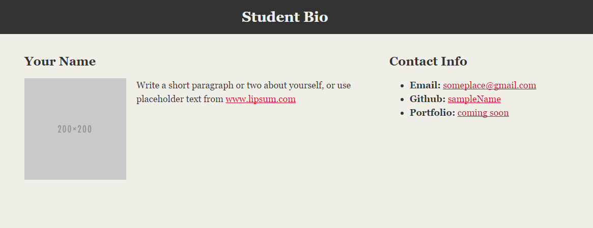

# HTML + CSS

In this activity, you will use CSS to add style to the portfolio.

## Instructions

* Open the [index.html](Unsolved/index.html) file and examine the HTML elements.

  * Replace the content with your own information to make this portfolio your own!

* Create a CSS stylesheet and name it `style.css`.

  * Using CSS, style the page and position the elements according to the design in the following image:

  

---
© 2021 Trilogy Education Services, LLC, a 2U, Inc. brand. Confidential and Proprietary. All Rights Reserved.