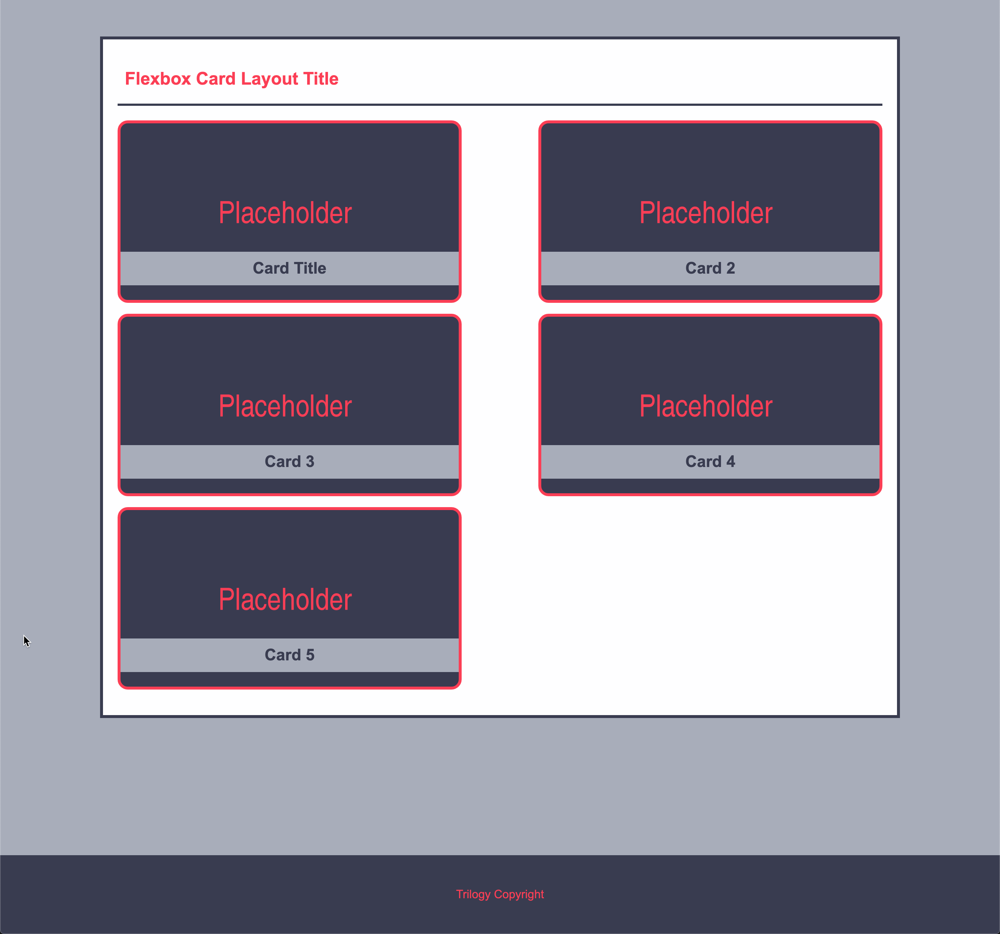

# Flexbox Card Layout

In this activity, you will use flexbox to organize the cards into two columns and center the contents of the card.

## Instructions

* Open [index.html](Unsolved/index.html) in your browser and look at the current layout.

* Open the [style.css](Unsolved/assets/css/style.css) file in your IDE and examine the code. Read the provided comments to understand what the CSS is doing.

  * Using flexbox, position the cards and the contents of the cards to resemble the layout in the following image:

  

  * Look for the `TODO`s in the comments!

## Hints

  * Each card is also its own flexbox!

---
© 2021 Trilogy Education Services, LLC, a 2U, Inc. brand. Confidential and Proprietary. All Rights Reserved.