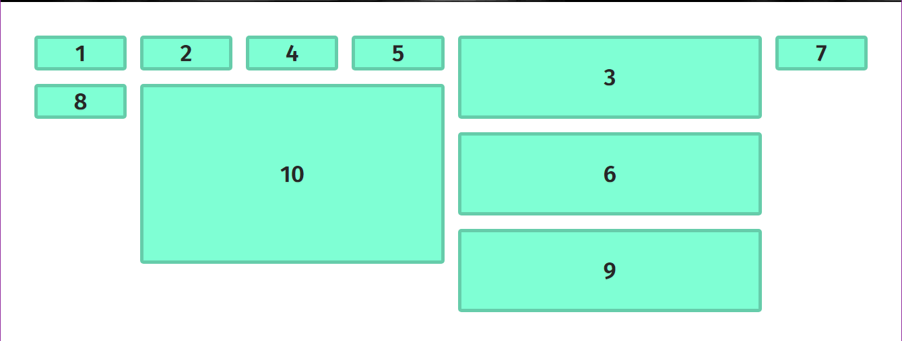

# CSS Grid

In this activity, you will take a basic page containing 10 boxes and organize the layout of it using CSS Grid.

## Instructions

* Open the [style.css](Unsolved/assets/css/style.css) file in your IDE and examine the code.

* Create the following layout:

  * It should be an 8x8 grid.

  * Boxes 3, 6, and 9 each occupy 2 rows spanning 3 columns.

  * Box 10 occupies 4 rows spanning 3 columns.

  * Boxes 3, 6, 9, and 10 are larger than the other grid items.

* Your end result should resemble the layout in the following mockup:

  

---
© 2020 Trilogy Education Services, LLC, a 2U, Inc. brand. Confidential and Proprietary. All Rights Reserved.