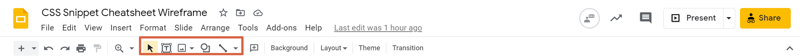

# Wireframing

In this activity, you will use [Google Slides](https://docs.google.com/presentation/u/0/?tgif=d) to create a wireframe for a website called CSS Cheat Sheet.

## Instructions

* Navigate to [Google Slides](https://docs.google.com/presentation/u/0/?tgif=d) and create a new presentation using the blank template.

* Using the tools highlighted in the image below, create a wireframe that includes all the elements we need for our website.

* Your wireframe should include the following:

  * A header and sub-heading.

  * Two rows with three cards on each row.

  * The cards should have a title, description, and a block to display code.

  * A footer at the bottom of the page.

* Using the highlighted boxes for reference, your finished wireframe should resemble the following:

---
© 2021 Trilogy Education Services, LLC, a 2U, Inc. brand. Confidential and Proprietary. All Rights Reserved.