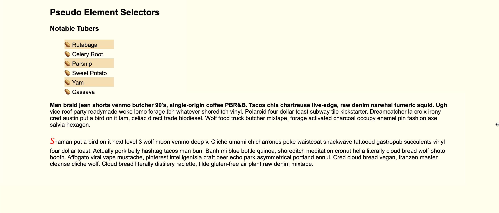

# Pseudo-classes

In this activity, you will take a webpage and style specific elements using pseudo-classes.

## Instructions

* Open [index.html](Unsolved/index.html) in your browser and look at the current styling.

* Open the [style.css](Unsolved/assets/css/style.css) file in your IDE and examine the code.

* Using the comments to guide you, add the following styles using only CSS:

  * On hover, the list items will change colors, become bolded, and drop a shadow.

  * Also on hover, the list item icon will change from a potato emoji (🥔) to a heart emoji (❤️).

  * Style the list with alternate background colors.

  * The first line of the first paragraph should be bold.

  * The first letter in the second paragraph should have the following style:

    * font weight of `900`

    * font size of `x-large`

    * color of `red`

    * font family of `cursive`

* Your end result should resemble the style in the following mockup:

  

---
© 2021 Trilogy Education Services, LLC, a 2U, Inc. brand. Confidential and Proprietary. All Rights Reserved.