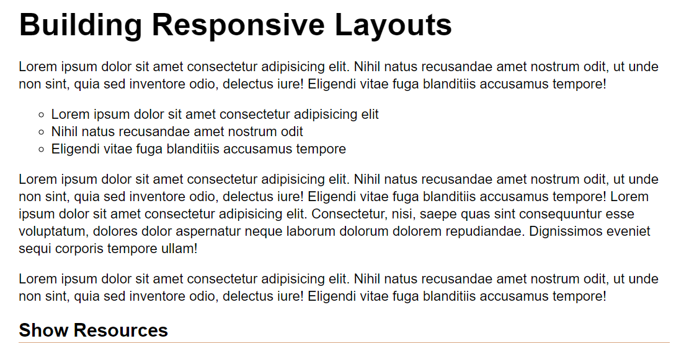
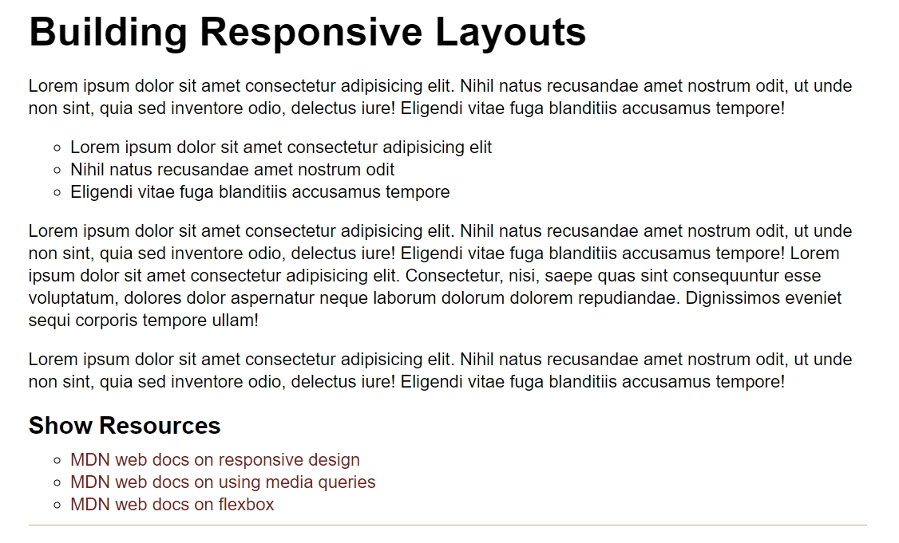

# 🏗️ Implement an Interactive Resources List

Work with a partner to implement the following user story:

* As a user, I want additional resource links at the bottom of the article.

## Acceptance Criteria

* It's done when the resource links are initially hidden on page load.

* It's done when the user moves the mouse over the text "Show Resources," and the resource links display.

## Assets

The following image demonstrates the web application's default appearance and functionality:

The following image demonstrates the web application's appearance and functionality when the cursor is over the "Show Resources" text:

You can use the following resource links for the content:

* [MDN Web Docs on responsive design](https://developer.mozilla.org/en-US/docs/Learn/CSS/CSS_layout/Responsive_Design)

* [MDN Web Docs on using media queries](https://developer.mozilla.org/en-US/docs/Web/CSS/Media_Queries/Using_media_queries)

* [MDN Web Docs on flexbox](https://developer.mozilla.org/en-US/docs/Learn/CSS/CSS_layout/Flexbox)
    
---

## 💡 Hints

* How would the CSS `display` property help?

* What examples can you find of other developers using the `:hover` pseudo-class in creative ways?

## 🏆 Bonus

If you have completed the activity and want to further your knowledge, work through the following challenge with your partner:

* How can you force pseudo-class styles to display using Chrome DevTools?

Use [Google](https://www.google.com) or another search engine to research this.

---
© 2021 Trilogy Education Services, LLC, a 2U, Inc. brand. Confidential and Proprietary. All Rights Reserved.