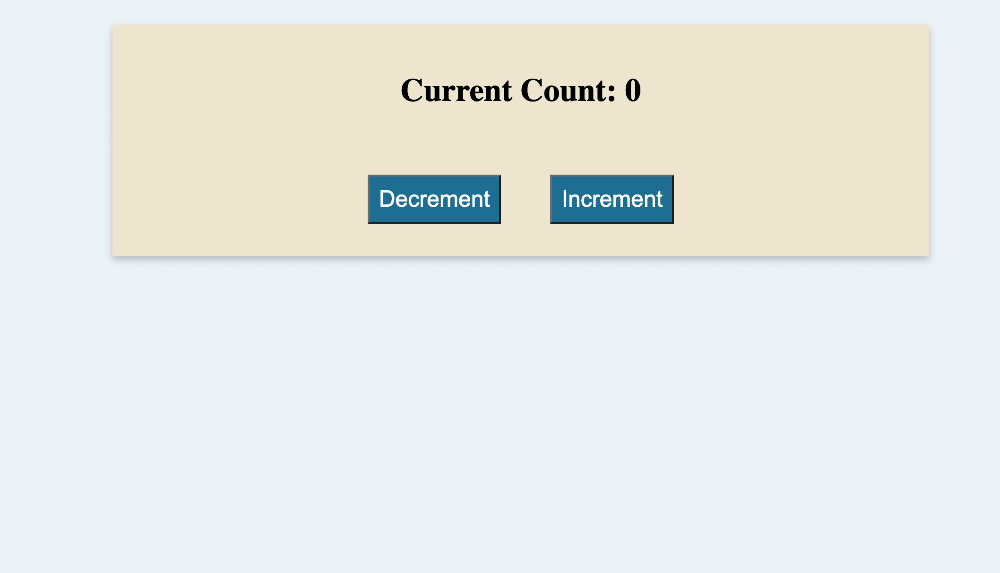

# 📐 Add Comments to Implementation of Event Handlers on Mouse Clicks

Work with a partner to add comments that describe the functionality of the code found in [Unsolved](./Unsolved/assets/js/script.js).

## 📝 Notes

Refer to the documentation:

[MDN Documentation on Event Listeners](https://developer.mozilla.org/en-US/docs/Web/API/EventTarget/addEventListener)

[MDN Documentation on Query Selectors](https://developer.mozilla.org/en-US/docs/Web/API/Document/querySelector)

## Assets

The following animation demonstrates the web application's appearance and functionality:

---

## 🏆 Bonus

If you have completed this activity, work through the following challenge with your partner to further your knowledge:

* A click is just one type of DOM event. What are some others?

Use [Google](https://www.google.com) or another search engine to research this.

---
© 2021 Trilogy Education Services, LLC, a 2U, Inc. brand. Confidential and Proprietary. All Rights Reserved.
