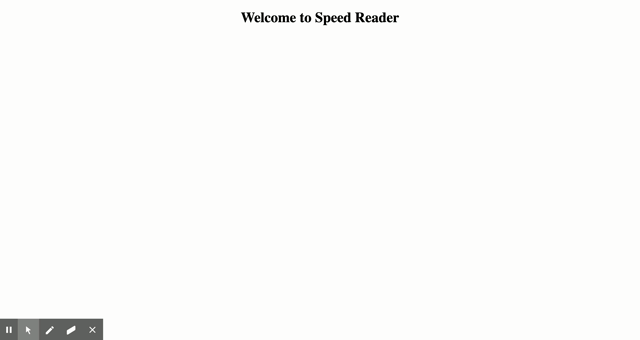

# 📖 Create a Speed-Reader

Work with a partner to implement the following user story:

* As a developer, I want to create a speed-reading application that prints a single word of a message at a time.

## Acceptance Criteria

* It's done when the number of seconds left on the countdown is printed on the screen.

* It's done when, after the countdown of 5 seconds ends, the words of the message appear on the screen, one word at a time.

## 📝 Notes

Refer to the documentation:

[MDN Documentation on setInterval](https://developer.mozilla.org/en-US/docs/Web/API/WindowOrWorkerGlobalScope/setInterval)

[MDN Documentation on clearInterval](https://developer.mozilla.org/en-US/docs/Web/API/WindowOrWorkerGlobalScope/clearInterval)

## Assets

The following animation demonstrates the web application's appearance and functionality:

## 💡 Hints

How does `displayMessage()` use the `setInterval()` and `clearInterval()` methods to display the words at an interval of 1000 milliseconds?

## 🏆 Bonus

If you have completed this activity, work through the following challenge with your partner to further your knowledge:

* Which `window` method is used to delay an action for a set number of milliseconds? Why might this method be useful?

Use [Google](https://www.google.com) or another search engine to research this.

---
© 2021 Trilogy Education Services, LLC, a 2U, Inc. brand. Confidential and Proprietary. All Rights Reserved.
