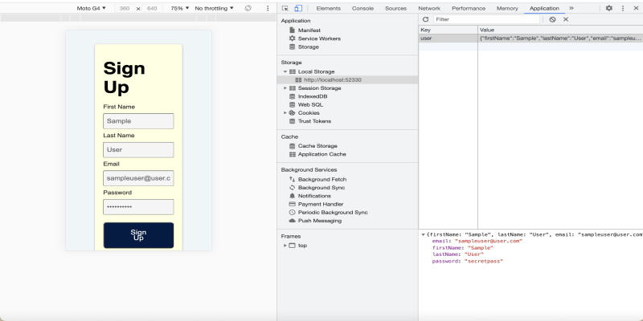

# 🐛 Object Not Saving as String Using localStorage

Work with a partner to resolve the following issue(s):

* As a developer, I want to save the information from a form as an object using `localStorage`.

## Expected Behavior

When a user clicks a Sign Up button, the form's current values are stored in an object as a string using `localStorage`.

## Actual Behavior

When a user clicks a Sign Up button, the form's current values are not stored in `localStorage`.

## Steps to Reproduce the Problem

Use the following steps to reproduce the problem:

1. Open `index.html` in your browser.

2. Enter data in the form field and click the Sign Up button.

3. Navigate to Google DevTool's Application tab and note that no data has been saved as a string in `localStorage`.

## Assets

The following image demonstrates the web application's appearance and functionality:

---
## 💡 Hints

Which JSON method can you use to return a string?

## 🏆 Bonus

If you have completed this activity, work through the following challenge with your partner to further your knowledge:

* What is JSON? How is it useful for sending and storing data?

Use [Google](https://www.google.com) or another search engine to research this.

---
© 2021 Trilogy Education Services, LLC, a 2U, Inc. brand. Confidential and Proprietary. All Rights Reserved.
