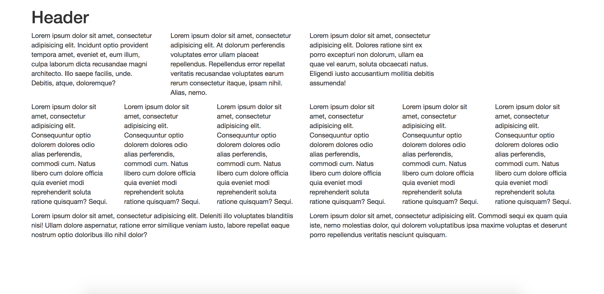

# Bootstrap Text Layout

In this activity, you will use Bootstrap to implement a grid system.

## Instructions

* Open [Unsolved/index.html](Unsolved/index.html).

* Using Bootstrap, create the layout in the following image: 

  

  * In the `<body>`, create a `
` with a `"container"` class.

  * Start creating your rows and columns.

  * Use `Lorem ipsum` for dummy text.

## Hint(s) 

* Prior to coding, spend some time drawing the grid layout.

* You may need to refer to the [Bootstrap grid system documentation](https://getbootstrap.com/docs/4.0/layout/grid/).