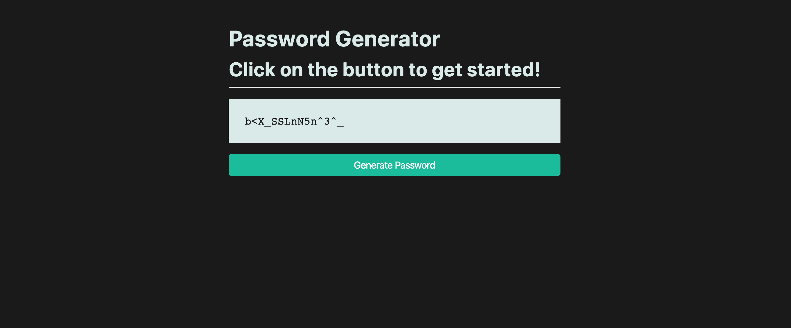

# 🐛 Password Generator Doesn't Work on Single Click

Work with a partner to resolve the following issues:

* As a user, I should be able to click the "Generate Password" button.

* As a user, I should be able to single-click the "Generate Password" button to generate a new password.

* As a user, I should be able to generate a 15-character password upon click. 

## Expected Behavior

When a user single-clicks the "Generate Password" button, a 15-character password is printed to the page.

## Actual Behavior

When a user single-clicks the "Generate Password" button, nothing happens.

## Steps to Reproduce the Problem

1. Open `index.html` in the browser.

2. Click the "Generate Password" button to see that nothing happens.

## Assets

The following image demonstrates the web application's appearance and functionality:

---

## 💡 Hint 

* How can we ensure that our HTML elements have the correct event listeners attached to them?
  
## 🏆 Bonus 

If you have completed the activity and want to further your knowledge, work through the following challenge with your partner:

* What are alternate methods to add event listeners? Use [Google](https://www.google.com) or another search engine to answer this question.

---

© 2021 Trilogy Education Services, LLC, a 2U, Inc. brand. Confidential and Proprietary. All Rights Reserved.
