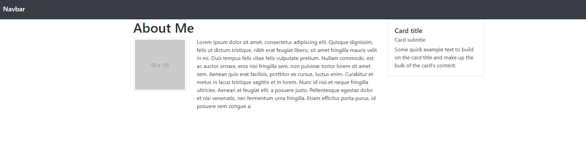

# Bootstrap Card Layout

In this activity, you will use the Bootstrap grid layout with Navbar and Card components.

## Instructions

* Open [Unsolved/index.html](Unsolved/index.html).

* Using Bootstrap, build a page matching the design in the following image:

   

  * In the `<head>`, import Bootstrap using the CDN.

  * In the `<body>`, add a responsive Navbar that automatically collapses at the `lg` breakpoint.
 
  * In the `
` with the `"container"` class, start creating your rows and columns of the grid layout.

    * Create one row and within that create a column. Add a heading "About Me".

    * Add a row and within that create a column. Add an image using [http://placehold.it](http://placehold.it) to generate a placeholder image of 150x150 pixels.

    * Within that same row, add one more column. Add a paragraph using `Lorem ipsum` for dummy text.

    * Create a new column with a Card component.

* Play around with the width of the columns to make it all fit and match the given design to the best of your ability. 

## Hint(s)

* Refer to the Bootstrap [Navbar documentation](https://getbootstrap.com/docs/4.3/components/navbar), [Grid system documentation](https://getbootstrap.com/docs/4.0/layout/grid/), [Card documentation](https://getbootstrap.com/docs/4.3/components/card/).

## Bonus

* Add `About`, `Portfolio`, and `Contact` Navbar items