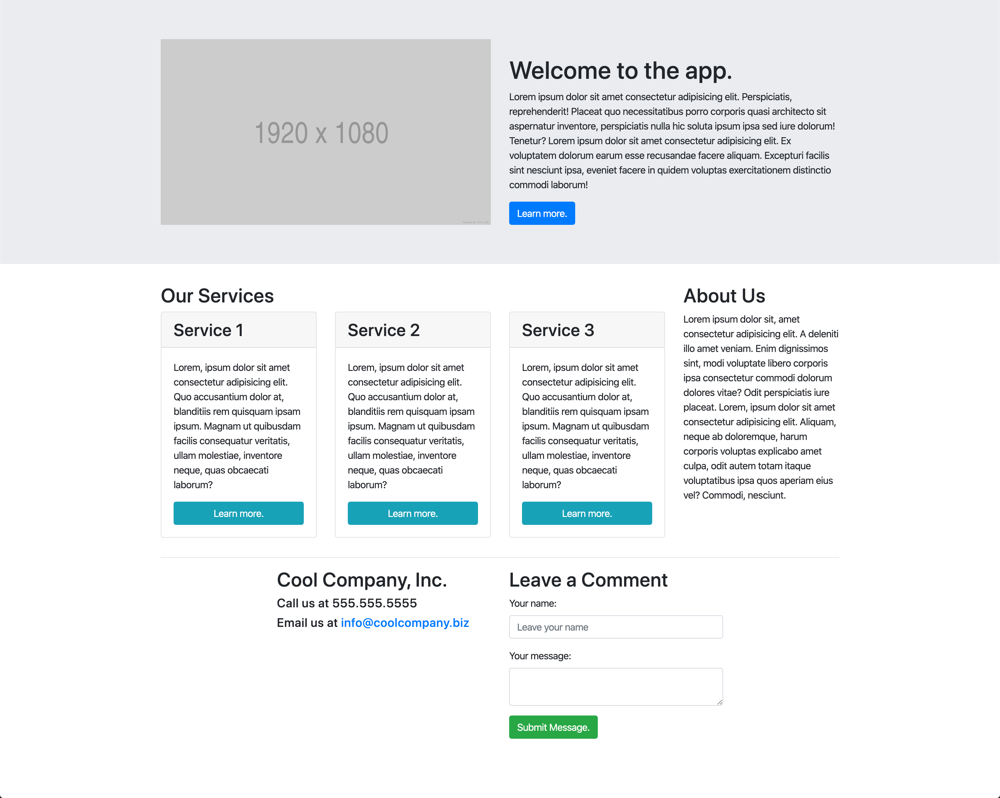

# 📖 Implement Responsive Layout

Work with a partner to implement the following user story:

* As a developer, I want to be able to create a responsive layout without having to write custom CSS.

## Acceptance Criteria

* It is done when the page displays a multicolumn layout on large screens and matches the mock-up provided.

* It is done when the screen displays in a single-column layout on smaller screens and matches how it looks currently.

## 📝 Notes

Refer to the following documentation:

[Bootstrap documentation for the grid](https://getbootstrap.com/docs/4.5/layout/grid/)

## Assets

The following image demonstrates the web application's appearance and functionality:

---

## 💡 Hint

* Don't forget to use the previous activity as a guide to how the Bootstrap classes can be used.

## 🏆 Bonus

If you have completed the activity, work through the following challenge with your partner to further your knowledge:

* What are some ways that Chrome DevTools can demystify the CSS that powers the grid? Use [Google](https://www.google.com) or another search engine to research this question.

---

© 2021 Trilogy Education Services, LLC, a 2U, Inc. brand. Confidential and Proprietary. All Rights Reserved.
