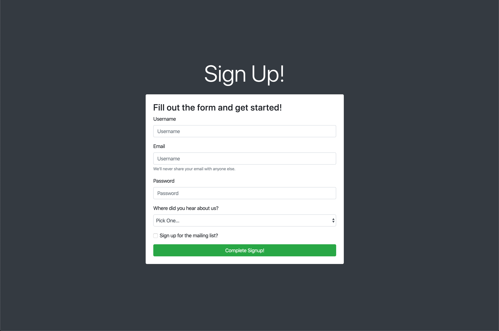

# 📖 Adjust Positioning and Styling on the Page

Work with a partner to implement the following user stories:

* As a developer, I want to be able to center the form on the page horizontally and vertically using no custom CSS.

* As a developer, I want to be able to adjust and add style to the page without writing any custom CSS.

## Acceptance Criteria

* It's done when the main content on the page is centered horizontally and vertically on the page.

* It's done when the background color of the page is dark.

* It's done when the background color of the form is white.

* It's done when the text color of the header on the page is white.

## 📝 Notes

Refer to the following documentation (look for Utilities in the left navigation menu): 

[Bootstrap Documentation](https://getbootstrap.com/docs/4.5/getting-started/introduction/)

## Assets

The following image demonstrates the web application's appearance and functionality:

---

## 💡 Hint

* Don't forget to use the previous examples and activities as a guide to how the classes can be used!

## 🏆 Bonus

If you have completed the activity and want to further your knowledge, work through the following challenge with your partner: 

* Using Chrome DevTools, what can you do to make this look more personalized? Try updating some of the more generic styles to use different colors or font sizes.

---

© 2021 Trilogy Education Services, LLC, a 2U, Inc. brand. Confidential and Proprietary. All Rights Reserved.