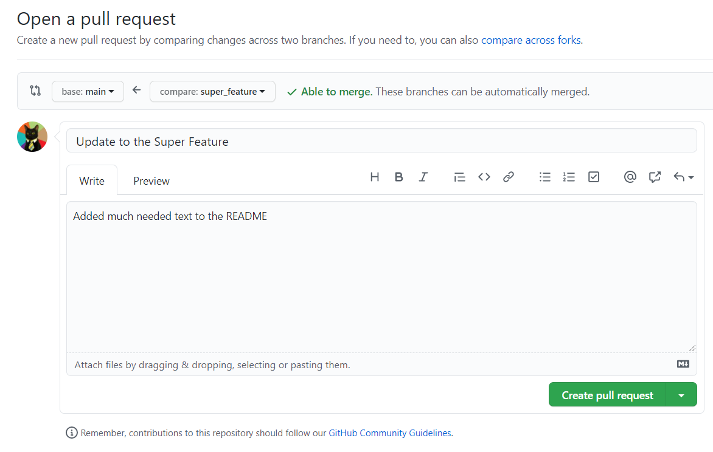
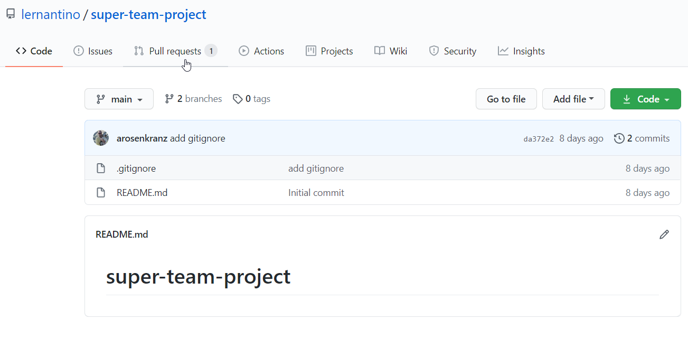
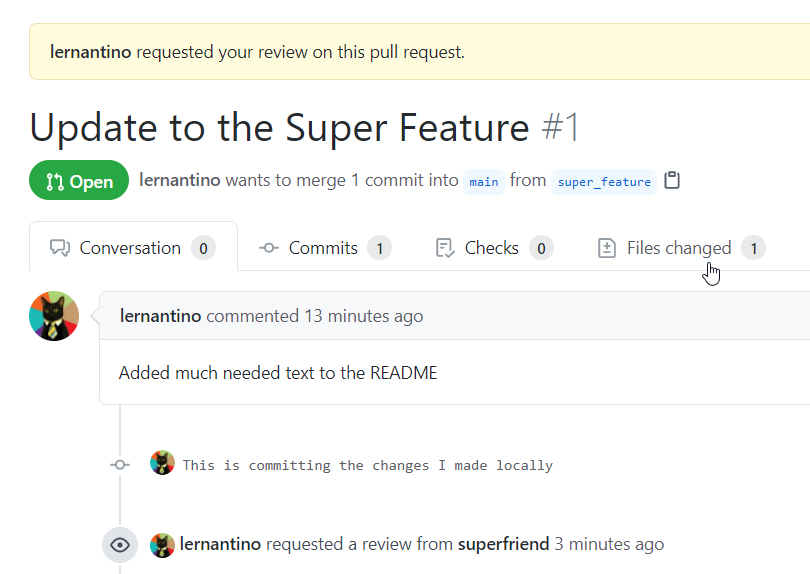
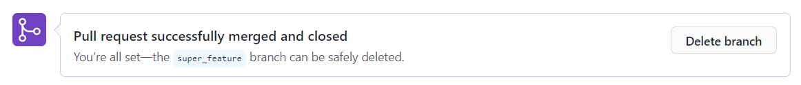

# Git Collaboration Flow

When working with a team, it's crucial for all members of the team to agree on a workflow that ensures both the team's ease of working together and the application's integrity. In web development, this workflow typically revolves around the use of Git and GitHub.

Having multiple developers work with code in a single repository can be hectic. To avoid conflict, developers must record and communicate changes effectively. Having multiple branches and all the information in a centralized location like GitHub provides workflows that are easy to set up and that developers can rely on.

In this activity, we will walk through a situation that allows you to practice effectively collaborating with other developers on a web application that is hosted on GitHub.

> **Important:** Because this is a group-based workflow, only one person in the group needs to create the repository. That person will then invite the other developers to join the repository as collaborators.

## Instructions

The following instructions describe how to establish a Git and GitHub collaboration flow.

### Create Repository and Set Up `.gitignore` File

In this step, you'll create a repository and set up a `.gitignore` file.

1. As with all projects, we need to start by creating a repository. Navigate to [GitHub](https://github.com) and create a new repository for your project. Ensure that the option to add a `README.md` file is checked.

2. Once the repository has been created, clone it to your machine using the `git clone <repository-name>` command and open the entire application in VS Code.

3. At the root of the application, use VS Code or the command line to create a file named `.gitignore`. This file will store a list of files or folders that may end up in the application but that we don't want to keep on GitHub.

4. Add the following line to the newly created `.gitignore` file:

	```text
	.DS_Store
	```

  The `.DS_Store` file is a file unique to macOS that the operating system automatically creates to internally store a directory's attributes, so Windows users have likely not encountered this before. This file has no bearing on the actual project code, so it's best to always add it to the `.gitignore` file to ensure that it never makes it to the actual GitHub repository.

5. Now save your code, commit it, and push it to the `main` branch using the following commands:

	```bash
	git add -A
	git commit -m 'add gitignore file'
	git push origin main
	```

Great&mdash;now the application is ready for other developers! Before we add those developers, however, let's add some protective measures to the repo on GitHub.

### Protect the `main` Branch by Adding Branch Protection Rule

When you work alone on a project, it's a safe assumption that any code that is pushed to the `main` branch will come from one course, so it's easy to keep track of who added what code and whether it works or not. When working with others, however, certain rules need to be put in place to keep every developer in sync and in agreement on what code is ready for production.

Luckily, GitHub has some features we can add to a repo to stay in sync more easily. Let's add them now:

1. Navigate to the repository on GitHub and select the Settings tab for the repo. The resulting page should look like the following image:

	

2. Once there, look in the left column's menu and select the Branches option. Then find the Add Rule button in the main content on the right, and select it. See the following image for reference:

	

After we select Add Rule, a page titled "Branch protection rule" will appear. On this page, we'll set up the repository so that no code can be pushed to the `main` branch by any member of the developer team. All code that is to be merged into the `main` branch MUST be merged through a GitHub pull request. Let's add the following to this page:

3. For the "Branch name pattern" input field, enter the branch `main`.

4. Next, check the box next to the option for "Require pull request reviews before merging". This will open another set of options asking if we want multiple reviewers before allowing a pull request to be merged, but we can leave it at just one for now.

5. Finally, select the option to "Include administrators". This way, even the repository owner cannot push to `main` and has to follow all of the same rules as the rest of the developers.

6. Confirm that the correct rules are in place by comparing your repo's settings with the following image:

	

7. Make sure to select the Create button at the bottom of the page. The page will refresh and inform us that the rules have been created.

Great! Now the repository's `main` branch cannot have code added to it without a pull request, and that pull request must be reviewed and approved by at least one other developer on the project. Let's go add those other developers now!

> **Important:** We can still work locally in the `main` branch, though it's not recommended. The limitation we just put in place is that `git push origin main` will not work anymore. If you have accidentally done work in the local `main` branch and need to push it, you should checkout a new branch for that updated code and push it to that branch on GitHub instead.

### Add Collaborators to the Repository

GitHub allows developers to work together and contribute to a single repository in a few different ways. We will set up the repository so that certain other GitHub users can write data and read data to it. Let's add these collaborators by using the following steps:

1. In the GitHub repository's Settings page, select Manage Access from the menu on the left side. You should see the following image:

	

2. Once the modal dialog opens, start typing in the GitHub username of one of your collaborators, and the list should automatically populate that user's entry. The page should resemble the following image:

	

3. Select the entry and click the "Add `<github-username>` to `<project-repo-name>`" button. The updated Manage Access page should look like the following image:

	

	Now the user will need to accept the invitation to contribute to the repository. The owner of the repository can also select the small clipboard icon next to the Pending Invite note, copy the invite link, and send it to the collaborator directly.

4. This will only add one collaborator, so repeat this process for every collaborator on the project. Once all of the collaborators have accepted the invite, it's time to get coding!

### Create a New Feature Branch

GitHub allows us to create multiple branches from the `main` branch. This enables us to test multiple features at a time. By doing this, we can have multiple people working on a project without breaking the `main` branch.

> **Important:** From this step on, each collaborator can work on their own branches.

Follow these steps to create a feature branch, which will allow you to work safely aside from the `main` branch:

1. Once you have the command line open, confirm that you are in the right directory by using the following command:

	```bash
	cd <repository-name>
	```

2. You should be inside your repository's directory. Now we have to create a new branch on this repository where we can work without the changes affecting the `main` branch. To do this, enter the following command with a feature branch name of your choice:

	```bash
	git checkout -b <feature_branch_name>
	```

3. For our example, we will use `super_feature` as our feature branch name. In the command line, you should see the following code:

	```text
	Switched to a new branch 'super_feature'
	```

### Commit Changes to Feature Branch and Test Locally

Now that you have a new feature branch, it is time to make some changes to it by following these steps:

1. In the `README.md`, add a few lines describing your favorite part of JavaScript so far. Don't spend too much time on this; just write a sentence or two. See the following example:

	```text
	I enjoy JavaScript because it utilizes both functional programming and object-oriented programming.
	```

2. Save the `README.md` file. Now that you've made changes to the feature branch, it is time to confirm that the project still runs locally. In this case, we just changed the README.md file, but if this were an app, you would test the app locally before saving it to the feature branch.

3. If the project and its new feature are running as intended, we will save those changes to the feature branch. We do that by using the following commands:

	```bash
	git add -A
	git commit -m "This is committing the changes I made locally"
	```

4. With `git add`, we move the changes to a staging area, which tells Git that we want to group these changes in Git. It is important to know that `add` does not change the repository. The repository will change once you `commit` the changes.

### Push Feature Branch and Open Pull Request

When you are happy with your new feature and you have tested it, it is time to open a pull request so that others can review your changes and decide whether it is ready to be merged into the main project repo.

1.  Before we can make a pull request on GitHub, we first need to push the new feature to GitHub, by using the following command using your feature branch name:

	```bash
	git push origin super_feature
	```

2. After pushing your feature branch, you should see something like the following code in your command line:

	```text
	Total 0 (delta 0), reused 0 (delta 0), pack-reused 0
	remote:
	remote: Create a pull request for 'super_feature' on GitHub by visiting:
	remote:     https://github.com/lernantino/super-team-project/pull/new/super_feature
	remote:
	To https://github.com/lernantino/super-team-project.git
	* [new branch]     super_feature -> super_feature
	```

3. With the `super_feature` feature branch now on GitHub, it is time for us to open a pull request. A pull request will let team members know that the new `super_feature` branch is ready to be implemented to the `main` branch.

	Navigate to the `super_feature` branch on GitHub by going to your repository page. On your repository's GitHub page, look for the dropdown menu called `main`. Select it, and you should see the branches off your `main` branch. Select `super_feature`, as shown in the following image:

	

2. Once we have chosen the correct branch, a green "Compare & pull request" button should appear, like in the following image:

	

	When you are creating a pull request, it is best practice to be as descriptive as possible. It is important to let your team know exactly what you changed.

3. Select the "Create pull request" button so that it can be reviewed, as shown in the following image:

	

	> **Important:** Before submitting a pull request, make sure that you are comparing your branch to `main`. This means that the `base` branch should be `main`.

### Review Pull Request

You now have a pull request, but it is important that one of the team members carefully reviews the pull request for any mistakes that could potentially break the `main` branch.

Earlier, we created a rule that requires developers to open a pull request and have that pull request reviewed before merging a branch with `main`. The following image shows how this is enforced in GitHub:


On the right-hand side, you should see a Reviewers label. You can use this when you want a particular team member to review your pull request. The selected reviewer will be notified when the pull request is submitted. For the sake of this activity, you will also play the role of reviewer. Normally, you will have some type of agreement among your team on how to review a pull request. See the following image for reference:


Follow these steps to practice the pull-request review workflow:

1. Navigate to the repository on GitHub and select the "Pull requests" tab, as shown in the following image:

	

2. On this tab, you will see a list of all the pull requests for the specified branch. Right now, you should only see the pull request you made, but when you are working on bigger projects this number increases based on how often you make changes to your project. See the following image for reference:

	

3. On the Pull Request page, you should see a Files Changed tab, as shown in the following image:

	

4. To make comparing code less painful and increase efficiency, in this view you will see a side-by-side comparison of what exactly has changed in your repository, as shown in the following image:

	

5. In the top-right corner, you should see a green "Review changes" button. When you select "Review changes", a form will appear, and you will have a few options. You can simply comment (Comment), send a comment along with approval to merge (Approve), or send a comment with changes that need to be made before merging (Request changes). These tools play a key role in ensuring that your team stays focused and productive. See the following image for reference:

	

**Important:** It is important to carefully review all the changes so that no unwanted bugs break your `main` branch.

### Merge Feature Branch and Close Pull Request

We are approaching the final step. It's time to merge the branch with the `main` branch!

1. Once the pull request has been reviewed and tested, you will navigate to the appropriate pull request on GitHub. Locate and select the green "Merge pull request" button, shown in the following image:

	

2. You can add a comment with your merge before clicking Confirm.

3. Now you have merged your `super-feature` branch with the `main` branch! GitHub gives you the option to delete the branch you merged, but that might not always be ideal. Always check in with your team members before deleting a branch. See the following image for reference:

	

And that's it! This workflow might seem overwhelming, but it will eventually become second nature as you work with it more frequently.

### Hints

Ask an instructor or TA if you get stuck or have any questions! Check the [GitHub guide on collaboration flow](https://guides.github.com/introduction/flow/) for reference.

---
© 2021 Trilogy Education Services, LLC, a 2U, Inc. brand. Confidential and Proprietary. All Rights Reserved.
