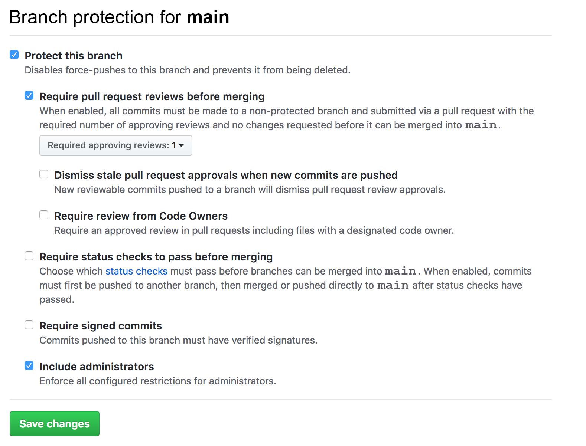

# Create a Repository and Protect Main Branch

In this activity, you will create a Github repository, add group members as collaborators, and protect your repository's main branch.

## Instructions

* One group member should create a new Github repository. Don't worry about the project name now; this can be changed later.

* From the repository's main page, click the "Settings" tab.

* Once in the repository's settings, select the "Manage access" menu item on the left.

* From the "Who has access" page, click "Invite a collaborator" and invite your group members to be project collaborators by entering their GitHub usernames one at a time.

* Each invited group member should receive an email they must open to accept the invitation.

⚠️ Only one member per project group needs to complete the following: 

* Navigate back to the repository's "Settings" page and then select "Branches" from the left sidebar.

* Under "Branch Protection Rules" select "main" from the dropdown.

* You should be presented with some options, check off the following:

  * "Protect this branch"

  * "Require pull request reviews before merging"

  * "Include administrators"

  

* If completed successfully, no one should be able to push directly to the main branch. Instead, all changes must be made in the form of pull requests that are to be reviewed by another group member.

### Hints

* Ask your instructor or TA if you get stuck!
