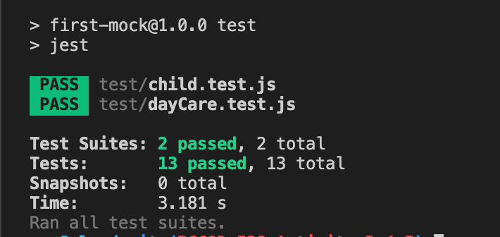

# 🐛 Running npm run test Results in Errors

Work with a partner to resolve the following issue:

* As a developer, I want the tests for `dayCare.test.js` to pass when I run `npm install` and `npm run test` in the console.

## Expected Behavior

* When we run `npm run test` in the console, we should not receive an error.

* When we run `npm run test` in the console, the tests for `dayCare.test.js` should pass.

## Actual Behavior

* When we run `npm run test` in the console, we receive the following error: `"Cannot spyOn on a primitive value; undefined given"`.

* When we run `npm run test` in the console, the tests for `dayCare.test.js` do not pass.

## Steps to Reproduce the Problem

To reproduce the problem, follow these steps:

1. Navigate to the `Unsolved` folder in this activity.

2. In the console, run `npm install`.

3. In the console, run `npm run test`.

## Assets

The following image demonstrates the web application's appearance and functionality:

---

## 💡 Hints

What does the error tell you about what is missing, and how do we capture the value of `console.log`?

## 🏆 Bonus

If you have completed this activity, work through the following challenge with your partner to further your knowledge:

* What are two or three other methods that can be used in conjunction with `spyOn`?

Use the [Jest API documentation on spyOn()](https://jestjs.io/docs/en/jest-object#jestspyonobject-methodname) to research this.

---
© 2021 Trilogy Education Services, LLC, a 2U, Inc. brand. Confidential and Proprietary. All Rights Reserved.
