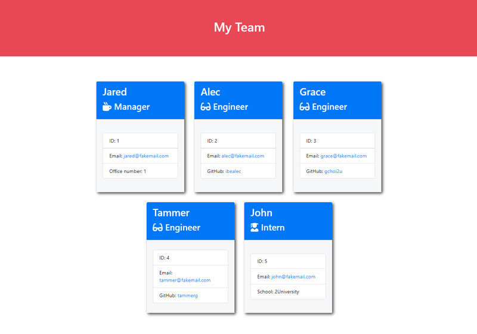

# 10 Object-Oriented Programming: Team Profile Generator

Your challenge is to build a Node.js command-line application that takes in information about employees and generates an HTML webpage that displays summaries for each person in a software engineering team. Since testing is a key piece in making code maintainable, you will also write tests for each part of your code and ensure that it passes all unit tests.

Because this application won’t be deployed, you’ll also need to provide a link to a walkthrough video that demonstrates its functionality and all of the tests passing. You’ll need to submit a link to the video **and** add it to the README of your project.

## User Story

```
AS A manager
I WANT to generate a webpage that displays my team's basic info
SO THAT I have quick access to their emails and GitHub profiles
```

## Acceptance Criteria

```
GIVEN a command-line application that accepts user input
WHEN I am prompted for my team members and their information
THEN an HTML file is generated that displays a nicely formatted team roster based on user input
WHEN I click on an email address in the HTML
THEN my default email program opens and populates the TO field of the email with the address
WHEN I click on the GitHub username
THEN that GitHub profile opens in a new tab
WHEN I start the application
THEN I am prompted to enter the team manager’s name, employee id, email address, and office number
WHEN I enter the team manager’s name, employee id, email address, and office number
THEN I am presented with a menu with the option to add an engineer, an intern, or finish building my team
WHEN I select the engineer option
THEN I am prompted to enter the engineer’s name, id, email, and GitHub username and I am taken back to the menu
WHEN I select the intern option
THEN I am prompted to enter the intern’s name, id, email, and school and I am taken back to the menu
WHEN I decide to finish building my team
THEN I exit the application and the HTML is generated
```

### Mock-Up

The following image shows the generated HTML’s appearance and functionality. The styling in the image is just an example, so feel free to add your own styles:




## Getting Started

This Challenge will combine many of the skills you’ve learned over the first ten weeks of this course. In order to help you get started, we’ve provided some guidelines in addition to the User Story and Acceptance Criteria.

Your application should use [Jest](https://www.npmjs.com/package/jest) for running the unit tests and [Inquirer](https://www.npmjs.com/package/inquirer) for collecting input from the user. The application will be invoked by using the following command:

```
node index.js
```

It is recommended that you start with a directory structure that looks like this:

```md
__tests__/			    // jest tests
  Employee.test.js
  Engineer.test.js
  Intern.test.js
  Manager.test.js
dist/               // rendered output (HTML) and CSS style sheet
lib/                // classes
src/                // template helper code
index.js            // Runs the application
```

The application must have these classes: `Employee`, `Manager`, `Engineer`, and `Intern`. The tests for these classes (in the tests directory) must all pass.

The first class is an Employee parent class with the following properties and methods:

* `name`
* `id`
* `email`
* `getName()`
* `getId()`
* `getEmail()`
* `getRole()`   // Returns 'Employee'

The other three classes will extend `Employee`.

In addition to `Employee`'s properties and methods, `Manager` will also have:

* `officeNumber`

* `getRole()`   // Overridden to return 'Manager'

In addition to `Employee`'s properties and methods, `Engineer` will also have:

* `github`  // GitHub username

* `getGithub()`

* `getRole()`   // Overridden to return 'Engineer'

In addition to `Employee`'s properties and methods, `Intern` will also have:

* `school`

* `getSchool()`

* `getRole()`   // Overridden to return 'Intern'

Finally, although it’s not a requirement, you should consider adding validation to ensure that user input provided is in the proper expected format.


## Review

You are required to submit the following for review:

* A walkthrough video demonstrating the functionality of the application and passing tests.

* A sample HTML file generated using your application.

* The URL of the GitHub repository. Give the repository a unique name and include a README describing the project.

- - -
© 2020 Trilogy Education Services, a 2U, Inc. brand. All Rights Reserved.
