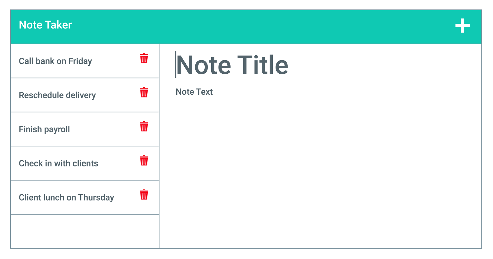
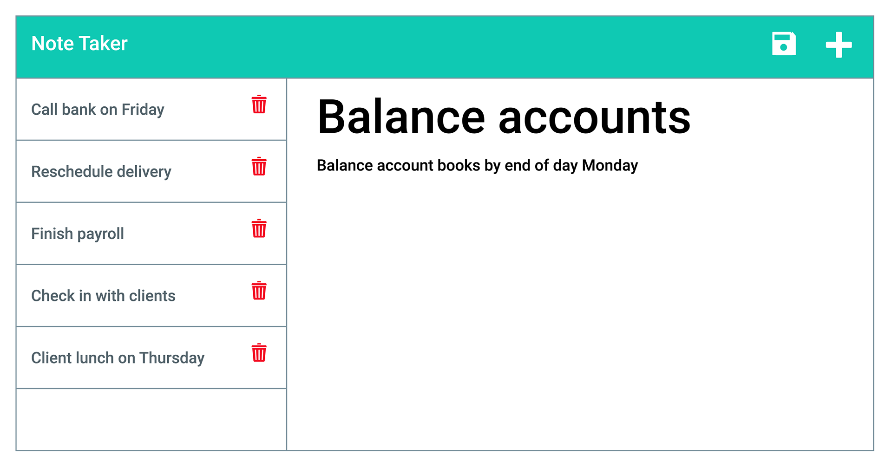

# 11 Express.js: Note Taker

For people that need to keep track of a lot of information, it's easy to forget important things. Being able to take persistent notes allows people to have written information available when they need it. Your challenge is to create a Note Taker application that can be used to write and save notes. This application will use an Express.js backend and save and retrieve note data from a JSON file.

The application frontend has already been created. It's your job to build the backend and connect the two and then deploy the entire application to Heroku.

Before you start, clone the [starter code](https://github.com/coding-boot-camp/miniature-eureka).


## User Story

```
AS A small business owner
I WANT to be able to write and save notes
SO THAT I can organize my thoughts and keep track of tasks I need to complete
```


## Acceptance Criteria

```
GIVEN a note taking application
WHEN I open the note taker
THEN I am presented with a landing page with a link to a notes page
WHEN I click on the link to the notes page
THEN I am presented with a page with existing notes listed in the left-hand column and empty fields to enter a new note title and the note’s text in the right-hand column
WHEN I enter a new note title and the note’s text
THEN a save icon appears in the navigation at the top of the page
WHEN I click on the save icon
THEN the new note I have entered is saved and appears in the left-hand column with the other existing notes
WHEN I click on an existing note in the list in the left-hand column
THEN that note appears in the right-hand column
WHEN I click on the write icon in the navigation at the top of the page
THEN I am presented with empty fields to enter a new note title and the note’s text in the right-hand column
```


## Mock-Up

The following images show the web application's appearance and functionality: 






## Getting Started

The application should have a `db.json file` on the backend that will be used to store and retrieve notes using the `fs` module.

The following HTML routes should be created:

* `GET /notes` should return the `notes.html` file

* `GET *` should return the `index.html` file

The following API routes should be created:

* `GET /api/notes` should read the `db.json` file and return all saved notes as JSON

* `POST /api/notes` should receive a new note to save on the request body, add it to the `db.json` file, and then return the new note to the client. You'll need to find a way to give each note a unique id when it's saved (look into `npm` packages that could do this for you).

## Bonus

You haven’t learned how to handle DELETE requests, but this application has that functionality in the frontend. As a bonus, see if you can add the DELETE route to the application using the following guideline:

* `DELETE /api/notes/:id` should receive a query parameter containing the id of a note to delete. In order to delete a note, you'll need to read all notes from the `db.json` file, remove the note with the given `id` property, and then rewrite the notes to the `db.json` file.


## Review

You are required to submit BOTH of the following for review:

* The URL of the functional, deployed application.

* The URL of the GitHub repository. Give the repository a unique name and include a README describing the project.

- - -
© 2020 Trilogy Education Services, a 2U, Inc. brand. All Rights Reserved.
