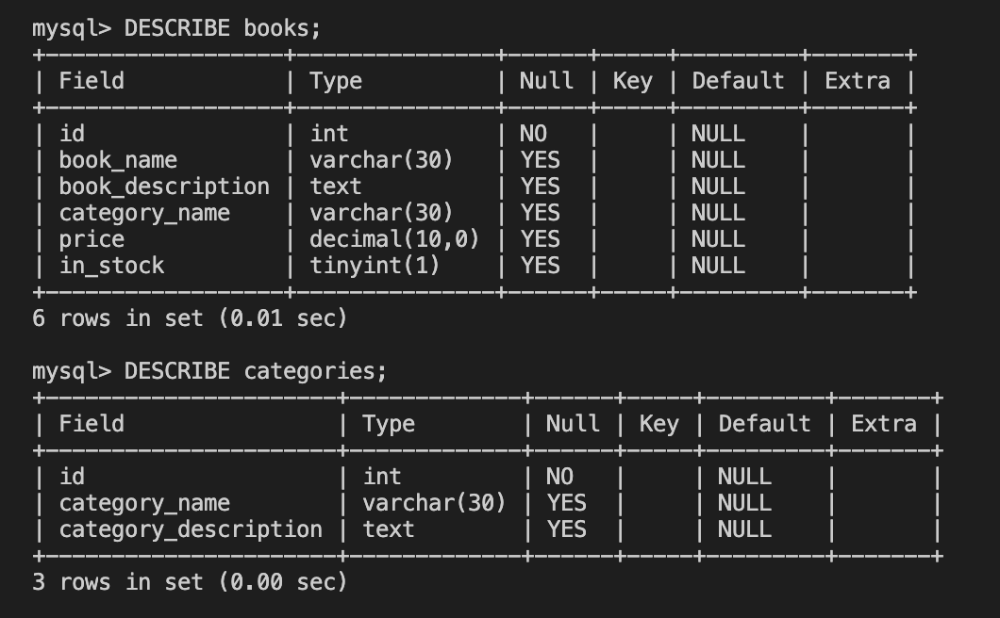

# 📖 Create Schema With Tables

Work with a partner to implement the following user story:

* As a developer, I want to add two tables to my MySQL database. 

## Acceptance Criteria

* It's done when the schema includes two tables.

* It's done when each table has at least three fields and each field has an assigned data type.

* It's done when each table includes an `id` field that does not accept `NULL` values.

## 📝 Notes

Refer to the documentation: 

[MDN Web Docs on Creating a Table](https://dev.mysql.com/doc/refman/8.0/en/creating-tables.html).

[MDN Web Docs on Data Types](https://dev.mysql.com/doc/refman/8.0/en/data-types.html)

## Assets

The following image demonstrates the web application's appearance and functionality:

---

## 💡 Hints

* What MySQL command do we use to display a table and information about each field's data types? 

## 🏆 Bonus

If you have completed this activity, work through the following challenge with your partner to further your knowledge:

* What are some issues we can avoid by having a well designed schema?

Use [Google](https://www.google.com) or another search engine to research this.

---
© 2021 Trilogy Education Services, LLC, a 2U, Inc. brand. Confidential and Proprietary. All Rights Reserved.
