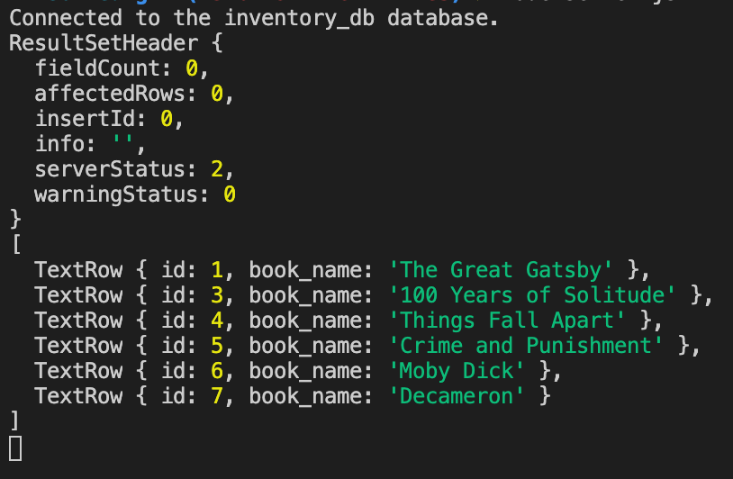

# 🐛 Query Not Deleting Row from Table

Resolve the following issue(s):

* As a developer, I want to be able to delete a specific row from the `books` table. 

## Expected Behavior

When I run `server.js`, the row with the `id` of `2` should be deleted from the table and the updated table displayed in the console.

## Actual Behavior

When I run `server.js`, a `ER_PARSE_ERROR` results and the table is not updated. 

## Steps to Reproduce the Problem

1. In the MySQL Shell, execute the `db/schema.sql` file. 

2. Next, execute the `db/seeds.sql` file. 

3. Run `node server.js` to start the Express server. The results of the query and the table are shown in the console. 

## Assets

The following image demonstrates the web application's appearance and functionality:

---

## 💡 Hints

What does the `?` represent in a prepared statement? 

## 🏆 Bonus

If you have completed this activity, work through the following challenge with your partner to further your knowledge:

* How can you set a user-defined values using a MySQL statement? 

Use [Google](https://www.google.com) or another search engine to research this.

---
© 2021 Trilogy Education Services, LLC, a 2U, Inc. brand. Confidential and Proprietary. All Rights Reserved.
