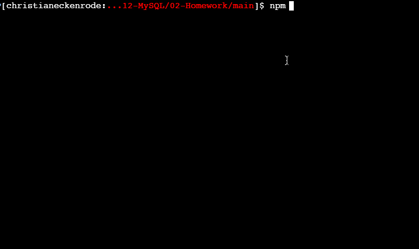

# 12 SQL: Employee Tracker

Developers are often tasked with creating interfaces that make it easy for non-developers to view and interact with information stored in databases. These interfaces are known as Content Management Systems (CMS). Your challenge this week is to build a command-line application to manage a company's database of employees using Node.js, Inquirer, and MySQL.

Because this application won’t be deployed, you’ll also need to provide a link to a walkthrough video that demonstrates its functionality and all of the acceptance criteria below being met. You’ll need to submit a link to the video and add it to the README of your project.

## User Story

```md
AS A business owner
I WANT to be able to view and manage the departments, roles, and employees in my company
SO THAT I can organize and plan my business
```

## Acceptance Criteria

```md
GIVEN a command-line application that accepts user input
WHEN I start the application
THEN I am presented with the following options: view all departments, view all roles, view all employees, add a department, add a role, add an employee, and update an employee role
WHEN I choose to view all departments
THEN I am presented with a formatted table showing department names and department ids
WHEN I choose to view all roles
THEN I am presented with the job title, role id, the department that role belongs to, and the salary for that role
WHEN I choose to view all employees
THEN I am presented with a formatted table showing employee data, including employee ids, first names, last names, job titles, departments, salaries, and managers that the employees report to
WHEN I choose to add a department
THEN I am prompted to enter the name of the department and that department is added to the database
WHEN I choose to add a role
THEN I am prompted to enter the name, salary, and department for the role and that role is added to the database
WHEN I choose to add an employee
THEN I am prompted to enter the employee’s first name, last name, role, and manager and that employee is added to the database
WHEN I choose to update an employee role
THEN I am prompted to select an employee to update and their new role and this information is updated in the database 
```

## Mock-Up

The following animation shows an example of the application being used from the command line:




## Getting Started

You’ll need to use the [MySQL2 package](https://www.npmjs.com/package/mysql2) to connect to your MySQL database and perform queries, the [Inquirer package](https://www.npmjs.com/package/inquirer) to interact with the user via the command-line, and the [console.table package](https://www.npmjs.com/package/console.table) to print MySQL rows to the console.

**Important**: You will be committing a file that contains your database credentials. Make sure your MySQL password is not used for any other personal accounts, because it will be visible on GitHub. In upcoming lessons, you will learn how to better secure this password, or you can start researching npm packages now that could help you.

You might also want to make your queries asynchronous. MySQL2 exposes a `.promise()` function on Connections to "upgrade" an existing non-promise connection to use promises. Look into [MySQL2's documentation](https://www.npmjs.com/package/mysql2) in order to make your queries asynchronous.

Design the following database schema containing three tables:


* **department:**

    * `id` - INT PRIMARY KEY

    * `name` - VARCHAR(30) to hold department name

* **role:**

    * `id` - INT PRIMARY KEY

    * `title` - VARCHAR(30) to hold role title

    * `salary` - DECIMAL to hold role salary

    * `department_id` - INT to hold reference to department role belongs to

* **employee:**

    * `id` - INT PRIMARY KEY

    * `first_name` - VARCHAR(30) to hold employee first name

    * `last_name` - VARCHAR(30) to hold employee last name

    * `role_id` - INT to hold reference to employee role

    * `manager_id` - INT to hold reference to another employee that is manager of the current employee. This field may be null if the employee has no manager

You may want to use a separate file containing functions for performing specific SQL queries you'll need to use. A constructor function or Class could be helpful for organizing these. You may also want to include a `seeds.sql` file to pre-populate your database. This will make the development of individual features much easier.


## Bonus

See if you can add some additional functionality to your application, such as the ability to:

* Update employee managers

* View employees by manager

* View employees by department

* Delete departments, roles, and employees

* View the total utilized budget of a department -- ie the combined salaries of all employees in that department


## Review

You are required to submit BOTH of the following for review:

* A walkthrough video demonstrating the functionality of the application.

* The URL of the GitHub repository. Give the repository a unique name and include a README describing the project.

- - -
© 2021 Trilogy Education Services, LLC, a 2U, Inc. brand. Confidential and Proprietary. All Rights Reserved.
