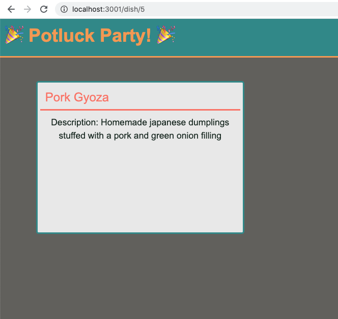

# 🏗️ Implement a GET Route for Food Item Descriptions 

Work with a partner to implement the following user story:

* As a party guest, I want to see a description of one food item that will be at the potluck when I visit `http://localhost:3001/dish/:num`.

## Acceptance Criteria

* It's done when the route called `/dish/:num` is properly configured to retrieve and return a food item and its description.

* It's done when the view displays a description for the food item, where the list number matches the route `/dish/:num`.

## Assets

The following image demonstrates the web application's appearance and functionality:

---

## 💡 Hints

How can you ensure that the correct Handlebars.js template is rendered?

## 🏆 Bonus

If you have completed this activity, work through the following challenge with your partner to further your knowledge:

* How can we render an array of objects using Handlebars.js?

Use [Google](https://www.google.com) or another search engine to research this.

---
© 2021 Trilogy Education Services, LLC, a 2U, Inc. brand. Confidential and Proprietary. All Rights Reserved.
