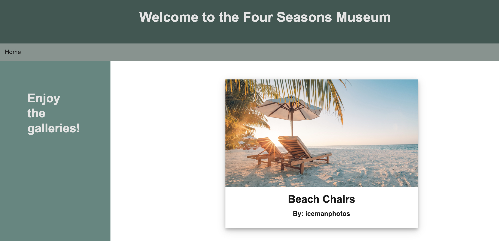

# 🏗️ Use Handlebars.js Partials to Reuse a Template

Work with a partner to implement the following user story:

* As a developer, I want to be able to render details of a painting by reusing the same Handlebars.js template.

## Acceptance Criteria

* It's done when the details for the paintings associated with the gallery are rendered using a Handlebars.js partial in the [gallery.handlebars](./Unsolved/views/gallery.handlebars) file.

* It's done when the `painting-details.handlebars` partial renders a card that links to that painting's page.

* It's done when the card includes a header with the painting's title.

* It's done when the card includes a body with the painting and the artist's name.

## Assets

The following image demonstrates how the painting's details should be rendered on the page:

---

## 💡 Hints

How do we set up the database? What command do we use to seed it? And what is the syntax for Handlebars.js partials?

## 🏆 Bonus

If you have completed this activity, work through the following challenge with your partner to further your knowledge:

* What are some other ways that we can use Handlebars.js partials? How else can partials be useful?

Use [Google](https://www.google.com) or another search engine to research this.

---
© 2021 Trilogy Education Services, LLC, a 2U, Inc. brand. Confidential and Proprietary. All Rights Reserved.