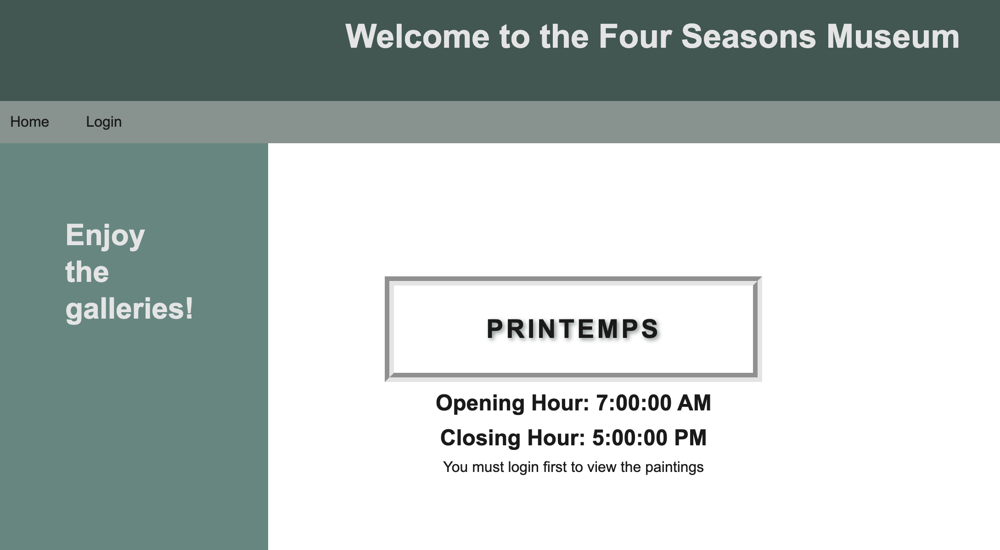

# 🏗️ Add Sessions to the Login Route

Work with a partner to implement the following user story:

* As a museum director, I want to allow visitors to view the gallery's paintings only after logging in.

* As a museum visitor, I want to be able to visit multiple pages while maintaining my logged-in status.

## Acceptance Criteria

* It's done when I can view the gallery's paintings only after I am logged in. Otherwise I am directed to log in.

* It's done when I can view the individual painting page only after I am logged in. Otherwise I am directed to log in.

* It's done when I can navigate from the gallery page to a painting's detail page without losing my logged-in status.

## Assets

The following image demonstrates what the museum visitor sees if they try to access the gallery page without logging in:

---

## 💡 Hints

* To test the routes, feel free to either create your own user or use the following credentials: 

  * `username`: "Sam"
  
  * `email`: "sam@email.com"
  
  * `password`: "password1234"

* If the session variables are set up when the user is created or logged in, which file would hold that info?

* How can the templates know if the user is logged in or not?

* What built-in helper method will help us render specific content depending on whether the user is logged in or not?

## 🏆 Bonus

If you have completed this activity, work through the following challenge with your partner to further your knowledge:

* What is the lifecycle of a session?

Use [Google](https://www.google.com) or another search engine to research this.

---
© 2021 Trilogy Education Services, LLC, a 2U, Inc. brand. Confidential and Proprietary. All Rights Reserved. 