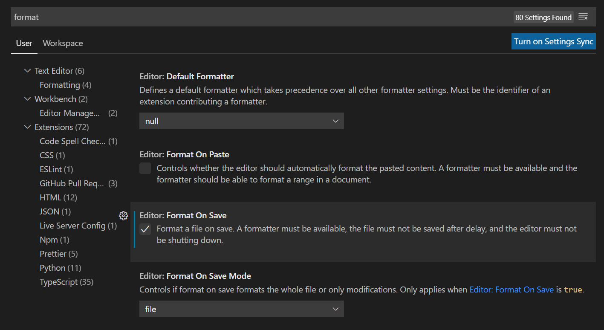

# Prettier

Developers tend to have a lot of opinions on how to format code. Do you use single quotes or double quotes for strings? Is it okay to have trailing commas on object properties? How often should you add spaces in between keywords? When should chained methods be moved to a new line?

As a team, you can agree on certain standards and use a tool like ESLint to highlight when your code doesn't meet these standards. However, the developer must still actually make those formatting changes. Fortunately, additional tools like **Prettier** can handle the formatting for you.

In this activity, we'll add Prettier to an existing codebase, link it with an ESLint configuration, and set up VS Code to run Prettier automatically.

## Instructions

Navigate to the `Unsolved` directory from the command line and run the following commands:

```bash
npm install
npm install prettier eslint-config-prettier --save-dev
```

This will install ESLint from the `package.json` file and add Prettier and the ESLint plugin as extra dependencies.

To observe Prettier in action, first open the `example.js` file and note how the `if` statements are structured, as shown in the following example:

```js
if (!isNaN(num)) {
  console.log("Not a number!");
}
else if (num < 0) {
  console.log("Please provide a positive number.");
}
else if (num >= 1000) {
  console.log("This number is too big.");
}
else {
  console.log("Thank you!");
}
```

Next, run the following command from the `Unsolved` directory:

```bash
npx prettier --write example.js
```

Remember, `npx` is a command to run Node.js packages, whereas `npm` is mainly used to install packages.

Now revisit the `example.js` file and notice how the `if` statements have been reformatted. One of Prettier's built-in rules is to keep the closing bracket and the next `else if` on the same line.

You can specify additional Prettier rules with a configuration or config file. In the `Unsolved` directory, create a new file called `.prettierrc.json` and add the following code to this file:

```json
{
  "singleQuote": true
}
```

Run the `npx prettier --write example.js` command again, and note how Prettier changed all of the double quotes to single quotes!

Continually executing this command isn't a great workflow, though. A better experience would be to let your code editor do it for you. This isn't a built-in feature of VS Code, so you'll need to install the [VS Code Prettier extension](https://marketplace.visualstudio.com/items?itemName=esbenp.prettier-vscode).

Once installed, the extension will search for any `.prettierrc.json` file and use those settings for formatting. Open the `example2.js` file and press Ctrl+Shift+P on Windows, or Command+Shift+P on macOS, then select "Format Document with" from the dropdown. Alternatively, you can type that into the search bar if it doesn't appear. Then select the "Prettier - Code formatter" option. This will auto-format the currently opened document.

You can also configure VS Code to do this each time you save a file. Navigate to Preferences (under the Code menu on macOS or under the File menu on Windows), and select Settings. In the Settings tab, search for "format" and select the option to Format on Save. This page will resemble the following image:



Revisit the `example2.js` file and add the following code somewhere inside it:

```js
const obj = {
  name: "Lernantino",
  occupation: "Developer"
};
```

Save the file, and Prettier will take over by changing the double quotes and adding a trailing comma to `occupation`.

Now open the `Unsolved/README.md` file and add the following code example as a `js` snippet somewhere inside it:

```js
// a bad example of declaring a string
const hello = "hello"
```

If you save the file, Prettier will correct the intentionally "bad" example code! You most likely don't need Prettier formatting markdown files, so you can tell Prettier to ignore them.

In the `Unsolved` directory, create a new file called `.prettierignore` and add the following line to it:

```text
*.md
```

This will disable Prettier on any file with a `.md` extension.

Lastly, we should inform ESLint that we are using Prettier. Because we are relying on Prettier for formatting rules, we don't need ESLint causing any confusion by highlighting things that Prettier doesn't care about.

Open the `.eslintrc.json` file and add the following property to the config object:

```json
"extends": ["prettier"]
```

This will turn off a handful of rules that typically conflict between the two libraries. Don't worry; ESLint will still provide warnings for other logic-related issues!

## Hints

* Double-check that Prettier formatted your code the way you intended. Sometimes Prettier makes incorrect assumptions, particularly with HTML documents.

* To learn more, refer to the [Prettier install guide](https://prettier.io/docs/en/install.html).

* The [Prettier documentation on options](https://prettier.io/docs/en/options.html) explains other configurations that you can add to the `.prettierrc.json` file.

---
© 2022 Trilogy Education Services, LLC, a 2U, Inc. brand. Confidential and Proprietary. All Rights Reserved.