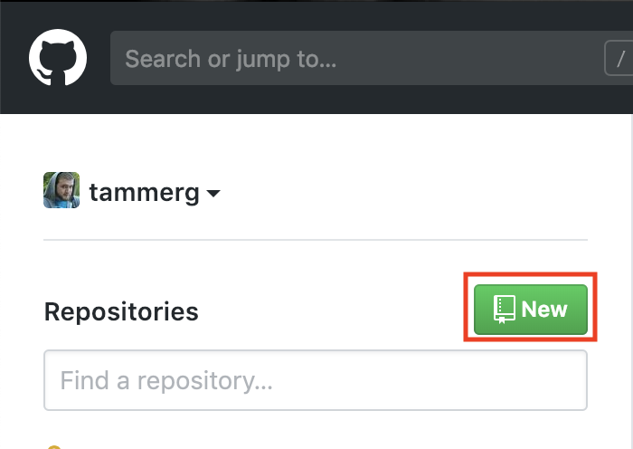
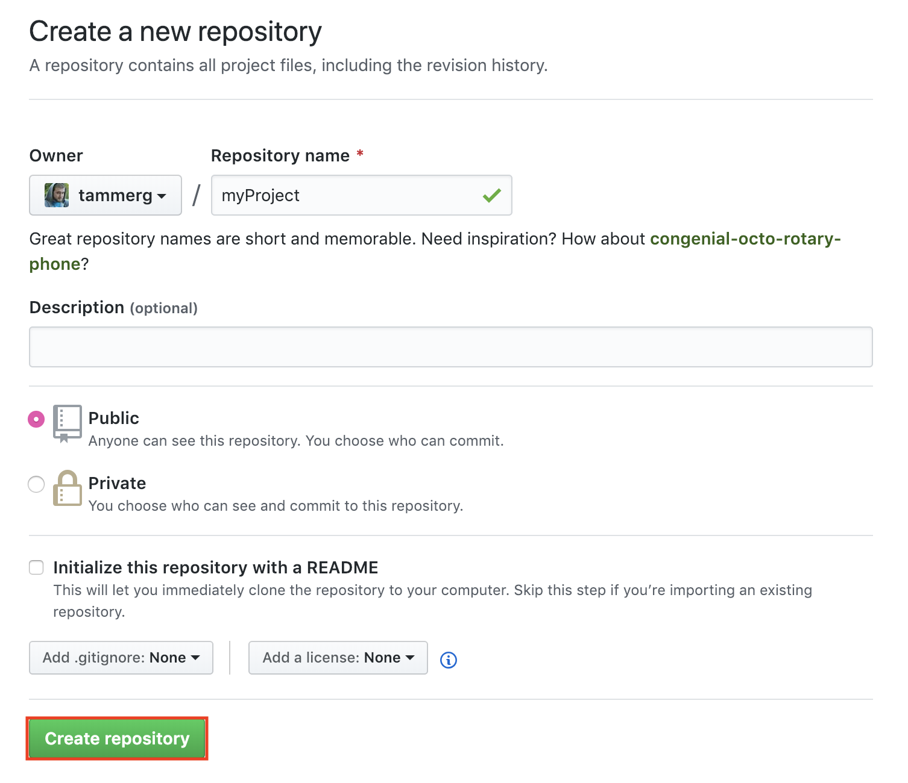
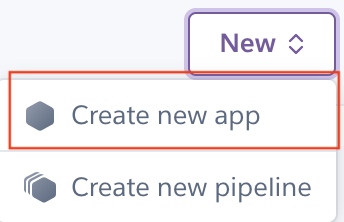
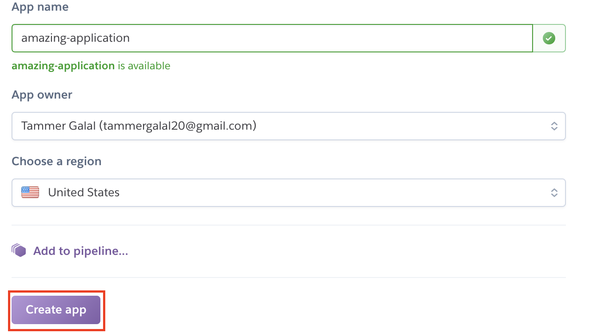
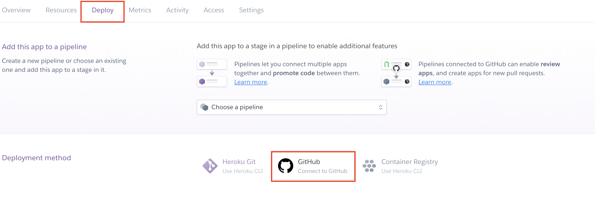
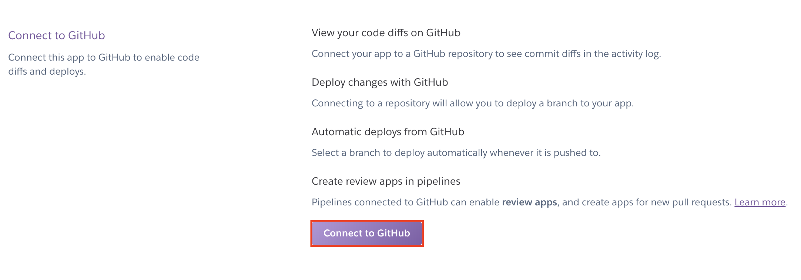
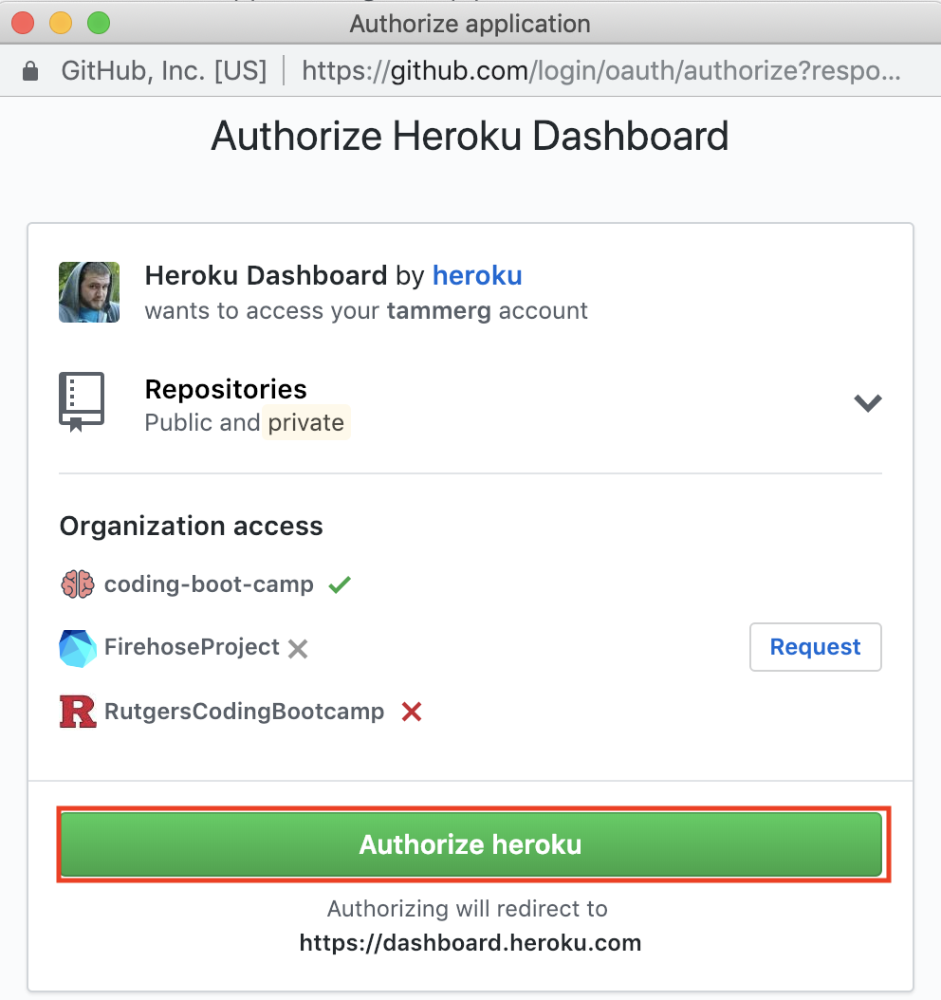

# How to connect a GitHub Repository to Heroku for Automatic Deployments

This short guide will take you through the steps of creating a GitHub repository and connecting it to a Heroku application. This will allow for automatic deployment every time you push to the `main` branch of your GitHub repository.

**Note**: Please ensure your application functions properly locally with no errors before you push to the `main` branch. Your application will not deploy if it has errors, so fix these locally before you continue.

## Create a GitHub Repository

First, we need to create a new GitHub repository.

1. Navigate to [GitHub](https://www.github.com) and sign into your account. 

2. On the left-side navbar, click the `New` button next to `Repositories`.

3. Name your new repository and then click `Create repository`.

## Create a Heroku Application

Now that we have a GitHub repository, we need to create a new Heroku application.

1. Navigate to [Heroku](https://www.heroku.com) and sign into your account.

2. On your dashboard, click the `New` button, and then in the dropdown, click `Create new app`.

3. Name your new application and then click `Create app`.

4. On the `Deploy` tab, click `GitHub` (connect to GitHub).

5. Next, click `Connect to GitHub`.

6. A modal will appear asking you to `Authorize Heroku` to access your GitHub. Click `Authorize Heroku`.

7. Now that you have authorized Heroku and given access to your GitHub account, use the search box to search for the repository you created earlier.

8. Click `Connect` to the right of the repo you created earlier.

9. Scroll down to the `Automatic Deployment` section, and click `Enable Automatic Deployments`.

Now you are good to go! Whenever you are working on your project and you push to `main` branch via pull request (You should never be pushing directly to main!), it will automatically push to Heroku, updating your live application!

We have also created a [video guide](https://youtu.be/GgNcs9zlFSA?list=PLOFmg4xbN_TPrB6w4rThsFanVxJI_SfER) for you to follow along with.

If you have any further questions or get stuck, please ask your instructional staff for assistance.
