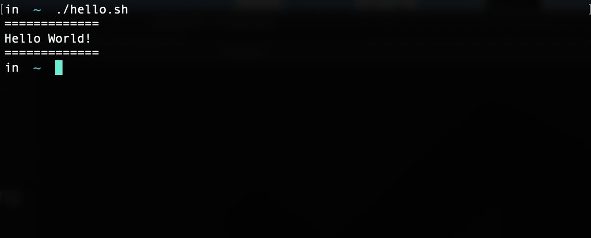
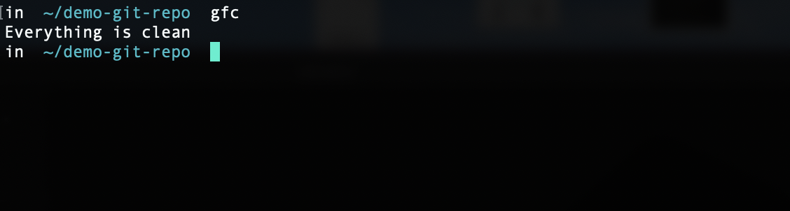
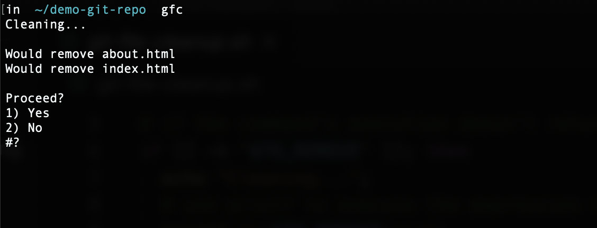
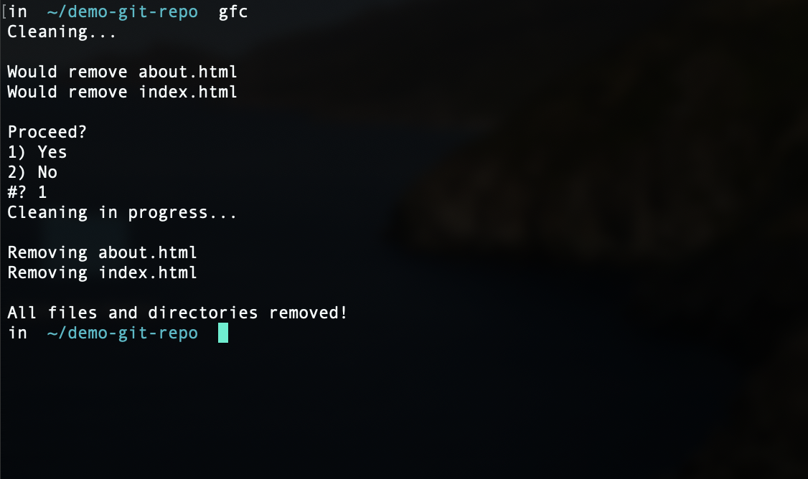

# Using Shell Scripts

## Introduction

Throughout our work, we've used the command line to perform important tasks. These tasks include actions built into our computers, performing Git commands and interacting with GitHub and Heroku, and running Node.js applications and installing modules using `npm`. Luckily for us, most of the commands that we use on a daily basis serve their purpose well enough. But we still haven't learned exactly _how_ they work. In this activity, we'll get a formal introduction to what's known as the Unix shell environment, and write a few small programs that we can execute from the command line.

The **Unix shell environment** serves as a layer between ourselves and our computers and gives us access to commands that are built into our systems. We actually know this already because we've been using some of these all along; commands such as `touch`, `mkdir`, and `cd` are all Unix shell commands that allow us to communicate with our computers. However, interactivity like this is just one part of the shell environment. We can also use the shell environment to run programs, much like Node.js, in the form of shell scripts.

A Unix shell script has its own syntax, which might feel familiar to commands we've written using JavaScript. While Node.js has many modules that allow us to execute similar commands, shell scripts allow us to write more universal and lightweight functionality to perform and automate tasks that JavaScript may not be as well-suited for. 

> **Important**: Windows computers and Apple computers running older macOS versions use the **Bash shell environment**. Apple computers with newer versions of macOS use the **Z shell environment** (known as **ZSH**), which is backwards-compatible with Bash. All the commands that we introduce today work in both environments, with only a few differences which we'll address as we go.

## Build a Simple Shell Script

Like with learning any other programming language, a great first shell-script project is to build a simple "Hello World" application. 

The first step is to create a file that holds the shell script. From the command line, use `cd ~` to navigate to the root directory on your computer. Create a `hello.sh` file in the root directory by using the following command:

```sh
touch hello.sh
```

Once that file is created, open it in VS Code and add the following line to the top of the file:

```sh
#!/bin/bash
```

This line of code&mdash;known as the [shebang interpreter directive](https://en.wikipedia.org/wiki/Shebang_(Unix))&mdash;is crucial. Without it, the file will not execute correctly on the command line. The **shebang interpreter directive** instructs the machine that's running the file how the following syntax in the file should be interpreted and executed. In this case, we're telling the machine that the file's contents should be interpreted and executed using the `bash` program.

While the shebang interpreter directive is important, it has nothing to do with the actual functionality of our script, so let's add that now with the following code:

```sh
# print "Hello World!" to the command line 
echo "============"
echo "Hello World!"
echo "============"
```

The hashtag symbol `#` is used for comments, but what do you think the `echo` command does? The `echo` command is used to print data. In this case, we want to print the phrase "Hello World!" on one line with dividing lines above and below it, so we use three different `echo` statements.

### Test the Script

That's all we need to do for this simple first application, so let's test it. Save the file, navigate to its location in the command line, and then run the file by using the following command:

```sh
./hello.sh
```

Depending on your operating system, you may run into a permissions error that looks something like the following: 

```sh
# it may say something other than `zsh`
zsh: permission denied: ./hello.sh
```

That's okay! With some operating systems, newly created files don't get permission to be executed by default, so we need to change that. Run the following command from the command line:

```sh
# use `chmod` to enter "change mode"
chmod +x ./hello.sh
```

We use the `chmod` command to adjust a file or directory's permissions and control whether it can be read from, written to, or executed by different types of users on the machine (including the machine itself). Because we only need to execute this file, we use the `+x` modifier. For more information, review this [Wikipedia article on chmod](https://en.wikipedia.org/wiki/Chmod).

Now run the file again. Your command line should resemble the following image:



### Add an Alias

Congratulations on writing and running your first script! This was sufficient, but we can also set up our scripts to be executed from anywhere on our machines. This allows us to contextualize our scripts to the directory from which we are running them. To do this, we need to create an **alias** in our shell environment that will execute the file for us.

Aliases need to be created in a specific file that is automatically interpreted and executed every time we start up our command-line applications. Depending on your operating system, this file is either `.bashrc` or `.zshrc`; both are located at the root path of the computer. The `rc` in these file names stands for "run commands."

From the command line, use `cd ~` to navigate to the root of path, and then use `ls -a` to see if the file exists. If it doesn't exist, we'll create it using the `touch` command. If you're on a Windows or older version of macOS, create a `.bashrc` file. If you're on a newer version of macOS, create a `.zshrc` file instead.

Once those files are created or located, open them in VS Code and add the following line to the file:

```sh
# fill in the path to your `hello.sh` file, starting at the root of your machine
# there should be no space between the command definition and value
alias hello="~/hello.sh"
```

Using the `alias` command, we instruct our shell to define the command `hello` and give it a value of the path to our `hello.sh` file. Think of it as creating a shortcut or bookmark so we can save time by not typing out its path every time. 

>**Note**: It's very important that there is no space between the command definition and value assignment, so make sure there is no space around the equal sign `=`.

Once that's done, save your file. This `hello` command won't be available just yet; we need to restart the command-line application so our updated run command's file will be read and the `hello` command will become defined.

**Note**: If you are using macOS 10.15 or later and using a `.zshrc` file, you may need to run the command `source ~/.zshrc` for the new `alias` command to work.

After restarting your command-line application, simply type the following command from anywhere on your command line:

```sh
hello
```

Great! Now we can run this command from anywhere on our machines. This is a very small example of the type of functionality that's implemented by programs such as `git`, `node`, and `npm`. Whereas we just created a simple script to be executed, those other programs have entire libraries of functionality that are made executable on our machines.

Let's move on to another example and learn how to make a slightly more useful script.

## Build a Script to Automate a Git Task

Now that we've learned how to write a shell script, let's create one that will actually make our lives easier by automating a Git command to clean up our repositories. 

Create a file called `git-file-cleanup.sh` in the root directory and open it in VS Code. Then add the shebang (`#!`) interpreter directive at the top of the file with the following code:

```sh
#!/bin/bash
```

With that in place, we can now add our script's functionality. When executed from within a Git repository, our script will check for untracked files and ask if we want to clean them up. This handy script will allow us to avoid having to manually remove files that we don't want to track or commit one by one!

Add the following code to the `git-file-cleanup.sh` file:

```sh
# set git clean command with necessary flags
# -f to force delete files (git won't remove them by default)
# -d to recursively check directories in repo and not just the level the command was run
# -n to perform a dry-run first, meaning it will identify files but not remove them
TO_REMOVE=`git clean -f -d -n`;
```

Here, we create a variable called `TO_REMOVE` and set it to a value of the `git clean` command. This command allows us to remove any untracked files from a project. We use the `-f` flag to force-delete them from the computer, the `-d` flag to recursively check every directory in the repo, and the `-n` flag to make the command's execution a "dry run." 

The dry run means that it'll go through all the steps it typically goes through and report back what will be removed, without actually removing it. This gives us a chance to confirm whether or not we want to proceed.

Before adding that user input for confirmation, let's check to see if there's anything even there for us to clean, by adding the following code: 

```sh
# if the command's execution doesn't return `null`
if [[ -n "$TO_REMOVE" ]]; then
  echo "Cleaning...";
  # use printf to execute the expression that `TO_REMOVE` variable holds
  printf "\n$TO_REMOVE\n\n";
  
else
  echo "Everything is clean";
fi;
```

With this `if` statement, we use a set of double square brackets `[[ <condition> ]]` to ensure that any white spaces in the string output by the execution of `TO_REMOVE` aren't read as separate arguments. To access a variable, we use the dollar sign `$`. 

If the executed Git command returns and it's not null, as checked by the `-n` flag, we will then move into our functionality. If it is null, we'll print a message indicating that everything is clean and finish the `if` statement with `fi` (many shell commands end with the opening command reversed). Did you notice the semicolon `;` after the `if` statement? That's so we can start a new statement `then` on the same line.

If there is something to clean, let's move into the `then` statement and use the `printf` command to actually execute the command held in the `TO_REMOVE` variable and print the output of it to the command-line application, just as if you were to run that command yourself. Once that's printed, we can now prompt the user to confirm if they want to move forward with the cleanup.

Add the following code to the file after the `printf` and before the `else`:

```sh
echo "Proceed?"


# use `select` command to prompt a list of options to be displayed for picking and store in `result` 
select result in Yes No; do
  # if we say "yes" in the prompt...
  if [[ "$result" == "Yes" ]]; then
    echo "Cleaning in progress...";
    echo "";
    # execute `git clean -f -d`
    git clean -f -d;
    echo "";
    echo "All files and directories removed!";
  fi
  break;
done;
```

Here is where we add a bit of interactivity to our script. The `echo` command will display a prompt asking the user if they would like to proceed. With the use of the `select` command, we prompt the user for "Yes" or "No" input on the command line; when they answer, the response will be stored in a variable called `result`.

Once we answer the prompt, we use the `do` command to continue the functionality. We check to see if we said "Yes" to cleaning our repo and if so, we execute the command as if we were typing it out on the command line. If we don't say "Yes," or the command finishes, we use the `break` command to exit our `do` loop and then use `done` to signify the end of that set of functionality.

### Add an Alias and Test the Script

That's all there is to this script, so let's test it! This script needs to be executed within the context of a Git repository, so it'll be easier if we set up an alias first. If you need to adjust the permissions on your file, do so now by running the following command on the command line:

```sh
chmod +x ./git-file-cleanup.sh
```

Once that's done, add an alias to your `.bashrc` or `.zshrc` file with the following code:

```sh
alias gfc="~/git-file-cleanup.sh"
```

Save the run command file that you just updated and restart your command-line application to load the alias into the environment. Once that's done, let's test it out by creating a local Git repo on our machines. You can do so by using the following commands:

```sh
# make directory
mkdir demo-git-repo
# step into directory
cd demo-git-repo
# initialize a new git repo
git init
```

Now if you execute the command `gfc` from the command line, you'll notice a message return stating that the repo is clean already, as the following image shows:



That's because we haven't made any untracked files just yet. Let's add a few files, add one to be tracked, and then run the command again. Use the following commands to do so:

```sh
# create a couple files
touch index.html about.html README.md

# only set up the README to be tracked
git add README.md

# run `gfc` command
gfc
```

After running the preceding commands, the result of the `gfc` command should look something like the following image:



As you can see in the preceding image, we've identified what could be removed if we were to execute this command, thanks to the dry run (`-d`) flag. We can now decided if we want to move forward. If we select `1` for yes, then the cleanup will proceed, as the following image shows:



Now our Git repository is clean of all untracked files! This may not be a command you need to run all the time, but it clearly demonstrates how we can use shell scripts to optimize workflows. 

## Reflection

Congratulations on becoming quickly acclimated to a new programming language! While the scripts we created aren't very complex, they allowed us to learn how some more advanced scripts may work. We can write scripts to perform a number of tasks and automate a lot of things, such as monitoring your computer's performance, finding where something exists in a project, and even scaffolding a project's file structure itself!

In your spare time, explore the scripts in the `Solved` directory to see what else can be done with shell scripts!

## Resources

To learn more about shell scripts, explore the following resources:

* [The Bash Hackers Wiki](https://wiki.bash-hackers.org/)

* [Learn X in Y Minutes, where X Equals Bash](https://learnxinyminutes.com/docs/bash/)

* [Bash Scripting Cheatsheet from DevHints.io](https://devhints.io/bash)

---
© 2021 Trilogy Education Services, LLC, a 2U, Inc. brand. Confidential and Proprietary. All Rights Reserved.
