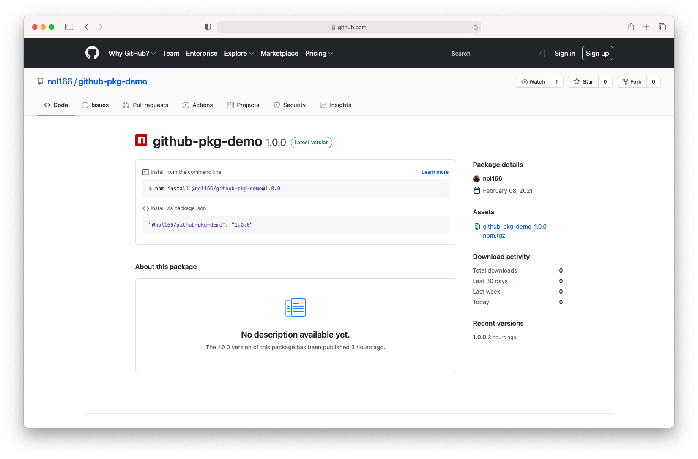
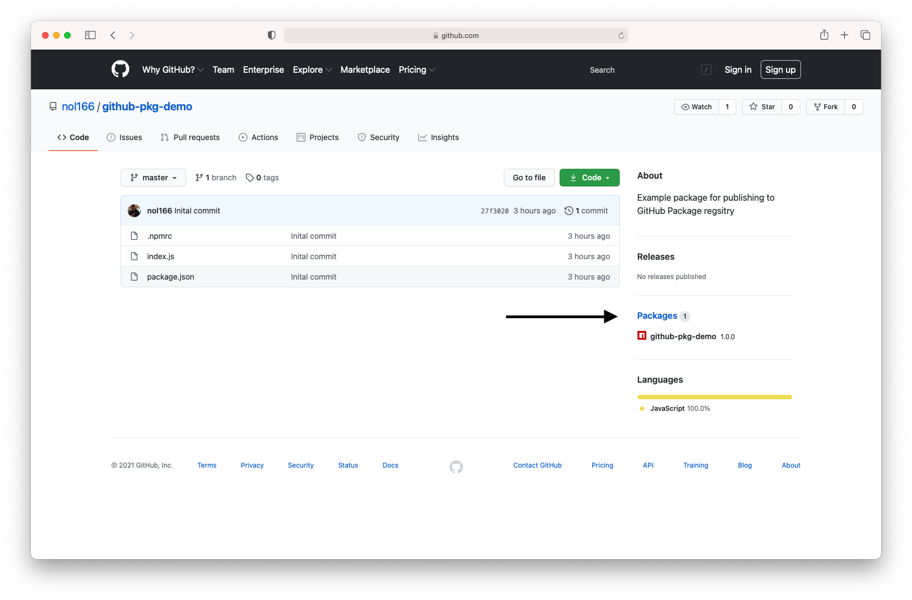

# GitHub Packages

Now that you have some serious web development skills under your belt, you might find yourself wanting to publish your own packages. GitHub has a great way to publish your own packages with relative ease.

Many times in this course you have installed packages using `npm install`, but now we will explore the other side of that equation. Today we will be writing and publishing an small package to GitHub's Package registry. This is a great way to share your code with other developers and also learn how a package registry works.

We will go through these steps together, but to be sure we have the right resources at our disposal, be sure to visit the link below to use as a reference throughout this guide.

* To get started visit the GitHub Packages guide on [Configuring npm for use with GitHub Packages](https://docs.github.com/en/packages/guides/configuring-npm-for-use-with-github-packages).

## Create an Access Token

In order to publish packages to GitHub Packages, we will first need to authenticate ourselves by generating a personal access token on GitGub.

1. Navigate to GitHub Settings - Developer settings - [Personal access tokens](https://github.com/settings/tokens).

2. Click "Generate new token" and give it a name of something like "GitHub Packages Demo".

3. Select the following scopes for this token: `repo` and `write:packages`. You will notice that after you check those two boxes, it will auto-select some nested options. This is to be expected.

4. Generate the token and copy it to your clipboard. **Important**: This token will not be visible once we leave this page, so be sure to leave the tab open or ensure it has been copied to your clipboard.

## Add Access Token to `.npmrc`

Now that we have our personal access token, lets add it to our user-specific `npm` configuration file.

1. In your terminal window, run the following command to edit or create `.npmrc` at the user directory. Be sure to replace TOKEN with your personal access token that we copied earlier.

    ```sh
    echo "//npm.pkg.github.com/:_authToken=TOKEN" > ~/.npmrc
    ```

2. To ensure it was created properly run the following command. The content of the `.npmrc` file should be output to the terminal.

    ```sh
    cat ~/.npmrc
    ```

## Create a Package

Now it's time to actually create a simple package that we can upload to GitHub Packages. Since we are just learning how to publish, let's create something very simple.

1. Create a new directory called `github-pkg-demo` and initialize it as a git repository by running `git init`

2. Next, create a `package.json` file by running `npm init -y`

3. Open `package.json` and modify the `name` field such that your project name includes your GitHub username. For example, if my username was `TestUser22` and the package name was `github-pkg-demo`, then I should have this in my `package.json`. Also we will want to add a repository entry that includes a `url` set to the value of what will be our remote.

    ```json
    }
      "name": "@TestUser22/github-pkg-demo",
      "repository": {
            "url": "git://github.com/TestUser22/github-pkg-demo.git"
        },
    }
    ```

4. Next, create a local `.npmrc` file at the root of your project directory. Inside the local `.npmrc` file, add the following. Be sure to replace OWNER with your own GitHub username.

    ```sh
    registry=https://npm.pkg.github.com/OWNER
    ```

    * ⚠️ Remember, while this file is titled `.npmrc`, we are pointing to GitHub's package registry and not the default `npm` registry. As a result, our package will get published to GitHub, and not to `npm`.

5. Create a `index.js` file at the root of your repository that contains the following content:

    ```js
    module.exports = () =>
        console.log('Hello world! I am living inside the GitHub Package Registry');
    ```

6. Be sure to add and commit these files before moving on to the next step using the following commands:

    ```sh
    git add -A
    git commit -m "Add package files"
    ```

7. Navigate to your personal GitHub profile and create a new repository called "github-pkg-demo". Make sure to not initialize with a `README.md` or `.gitignore`.

8. Add the remote URL given from your newly created repository on github to your local repository.

    ```sh
    git remote add origin git@github.com:GITHUB_USERNAME/github-pkg-demo.git
    git branch -M main
    git push -u origin main
    ```

    > **Note**: If you successfully set your local default branch to `main`, you do not have to run the `git branch -M main` command.

9. Now that we have everything ready to go, let's publish!

    ```sh
    npm publish
    ```

* **Note**: Remember that the `npm publish` command will publish our package to GitHub packages and not the `npm` registry because of the way we've configured our `.npmrc`.

## Installing GitHub Packages

If you want to share this package with someone, they can follow these instructions to install it:

1. Create a local `.npmrc` file in the project directory where the package will be installed and add the following code:

    ```sh
    @OWNER:registry=https://npm.pkg.github.com
    ```

    **Note**: Be sure to replace OWNER with your personal GitHub username.

2. Add the package name to the list of dependencies located in your `package.json` file.

    ```json
    "dependencies": {
        "@<YOUR_GITHUB_USERNAME>/github-pkg-demo": "1.0.0"
    },
    ```

3. Then, simply run `npm install` as you normally would.

    ```sh
    npm install
    ```



## Conclusion

Congratulations on publishing your first package to GitHub! Using the screenshots below, you can verify that your package was published successfully. Start by visiting your GitHub profile, and then click on "Packages" in the right-hand navigation, as shown in the following image:


