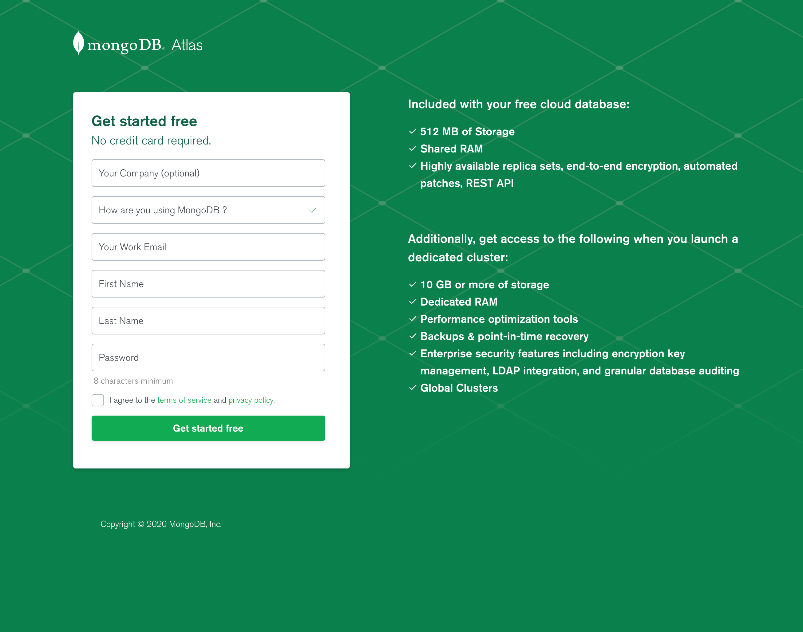
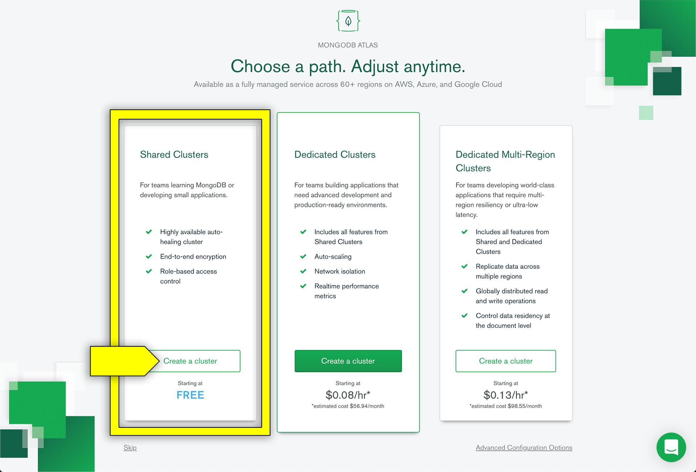
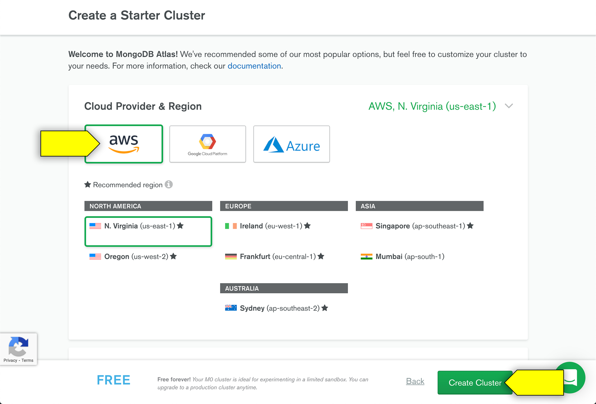
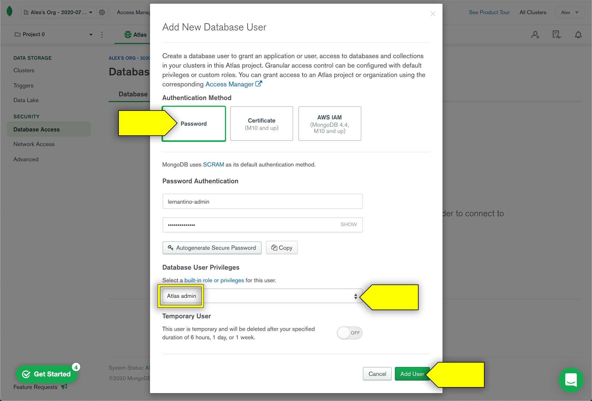
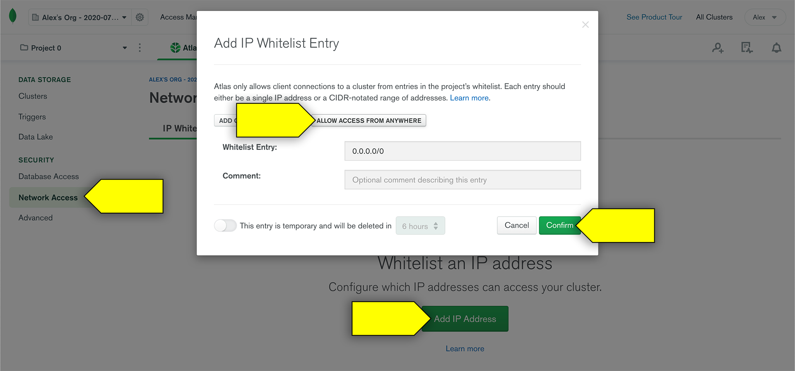

# Set Up MongoDB Atlas

In this guide, we'll walk through the steps required to create your account and initial cluster with MongoDB Atlas.

## What Is MongoDB Atlas?

MongoDB Atlas is a cloud-based database service that is created and maintained by MongoDB. It works with hosting services such as AWS, Azure, and Google Cloud to help users provision, maintain, and secure new databases for their applications.

We'll use its free service tier to host MongoDB databases for our production-ready apps when we deploy them. Learn more about it at the [MongoDB Atlas website](https://www.mongodb.com/cloud/atlas).

## Set Up Account and Initial Cluster

To get started, you'll need a MongoDB Atlas account.

1. To begin the sign-up process, navigate to the [MongoDB Atlas sign-up page](https://www.mongodb.com/cloud/atlas/signup), which is shown in the following image:

   

2. Fill in the required fields. In the "How are you using MongoDB?" dropdown, choose "I'm learning MongoDB". 

3. When you're done, click "Get started free".

### Choose a Path

Next you'll choose a path, which will determine how your databases are organized. You'll choose the free shared cluster option. A **cluster** is simply a server that allows you to create and maintain multiple MongoDB databases.

- Select the "Shared Clusters" plan by clicking its "Create a cluster" button, as shown in the following image: 

    

### Create a Starter Cluster

Next, you'll create a starter cluster.

1. When you select the "Shared Cluster" tier, you should see a screen to create your starter cluster. On this page, you're prompted to pick a service provider and where you'd like the cluster to be hosted. Because it's free, the options don't matter too much&mdash;it's easiest to just pick Amazon Web Services (AWS) as the provider and whatever recommended region is closest to you. 

     The following image shows this option being chosen:

   

2. On the next page, feel free to skip the "Cluster Tier" and "Additional Settings" options, as they don't pertain unless you want a paid plan.

3. Further down on this page, you have the option to name your cluster as well. If you leave it as is, it will be given a generic name like "Cluster0", but you can give it another name if you want.

4. Once you've chosen all of your settings for this cluster, select the "Create Cluster" button. This will take you to the MongoDB Atlas dashboard.

### Set Up Your MongoDB Atlas Dashboard

Because this is the first time you'll have seen this dashboard, you'll be guided through the steps to get started. Let's go through it here as well.

1. **Create a Cluster**: You've already done this in the previous step, so you're all set here!

2. **Add New Database User**: On the lefthand navigation menu, under Security, select the "Database Access" link. The following image shows the resulting modal with the options you'll select highlighted: 

   

    To fill out the form, follow these steps:

   * For Authentication Method, choose Password.
  
   * Under Password Authentication, create a username and password that you'll remember.
  
   * Under Database User Privileges, select "Atlas admin".

   * Do not enable "Temporary User" unless you want to make a new user every so often.
  
   * When you're done, click "Add User".

4. **Allow Your IP Address**: Finally you'll allow your IP address. The following image shows the various parts of this step highlighted:

    
       
    - In the lefthand navigation menu, under Security, click the "Network Access" link. 

    -  Click the "Add IP Address" button. The "Add IP Whitelist Entry" modal will appear. 

    - To make your database accessible from anywhere, click "Allow Access From Anywhere". This will set the Whitelist Entry value to `0.0.0.0/0`.

    - Click Confirm.

That's it for now! You don't need to worry about adding sample data or connecting just yet. 

Now that your accounts are all set up, you can move on to creating a production-ready database for deployment. For instructions, see [Deploy MongoDB Atlas](./MongoAtlas-Deploy.md).
