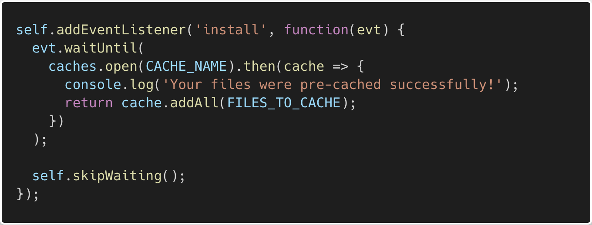
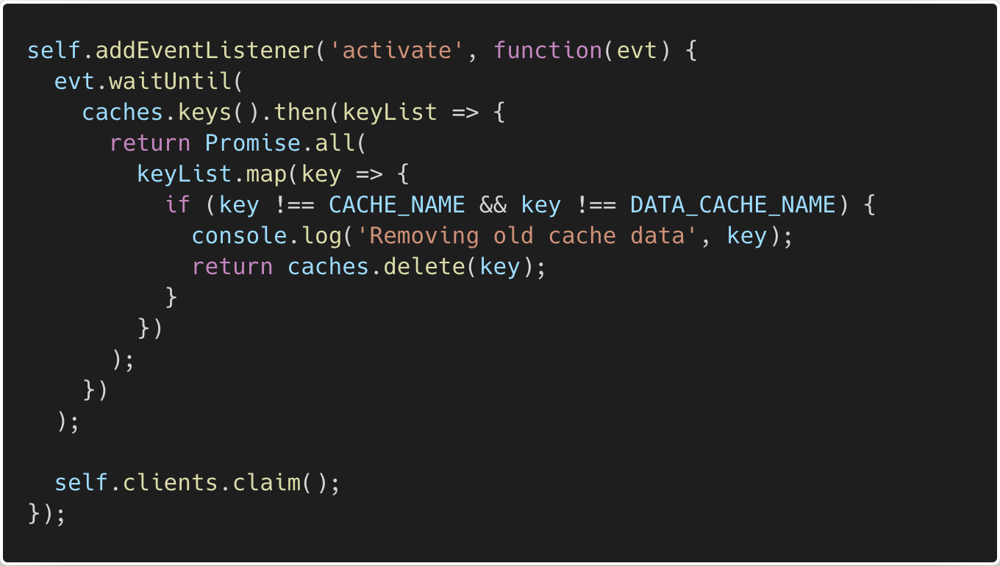

# Caching and Fetching Files

In this activity, you will be enabling functionality to allow the 'Image Gallery' app to work offline. You will install and activate the service worker that you registered in the previous activity. This will give the service worker the ability to cache the files we tell it to and deliver them in an offline experience for our users. 

Most of this code is standard, which is why they are provided for you. However, type out the code snippets since that will help you solidify what you are doing!

## Instructions

* Navigate to the [Unsolved/](Unsolved/) folder and run `npm install`, `npm run seed`, and `npm start` in your command line.

* Navigate to <http://localhost:3001> in Chrome and open the Dev Tools. Keep your Dev Tools open to monitor your progress and debug if needed.

* Open [service-worker.js](Unsolved/public/service-worker.js) and do the following:

  * Uncomment the code to set up the cache files.

  * Add the following code to install the service worker:

  

  * Next, add the following code to activate your service worker and remove any old data from the cache:

  

  * Finally, add the following code to intercept fetch requests:

  ```js
  self.addEventListener('fetch', function(evt) {
  
  });
  ```

  * Inside that function, if the request with a URL includes `/api/`, we need to handle those requests and store the responses in the cache:

  ```js
  if (evt.request.url.includes('/api/')) {
    evt.respondWith(
      caches
        .open(DATA_CACHE_NAME)
        .then(cache => {
          return fetch(evt.request)
            .then(response => {
              // If the response was good, clone it and store it in the cache.
              if (response.status === 200) {
                cache.put(evt.request.url, response.clone());
              }

              return response;
            })
            .catch(err => {
              // Network request failed, try to get it from the cache.
              return cache.match(evt.request);
            });
        })
        .catch(err => console.log(err))
    );

    return;
  }
  ```

  * If the request path does not include `/api/`, then we can assume the request is for a static file. Add the following code in the function handling the `fetch` event, right below the code handling the requests to `/api/`:

  ```js
  evt.respondWith(
    fetch(evt.request).catch(function() {
      return caches.match(evt.request).then(function(response) {
        if (response) {
          return response;
        } else if (evt.request.headers.get('accept').includes('text/html')) {
          // return the cached home page for all requests for html pages
          return caches.match('/');
        }
      });
    })
  );
  ```

* If done correctly, you should see your data cache in the Application tab of the Chrome Dev Tool and you should be able to access the Image Gallery app offline.