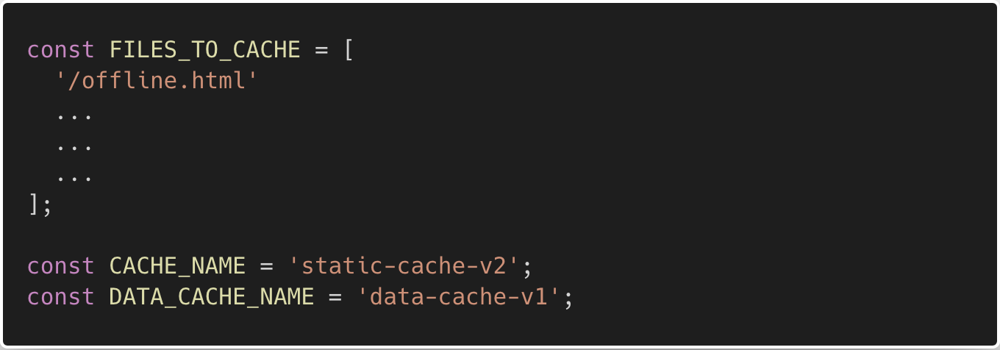
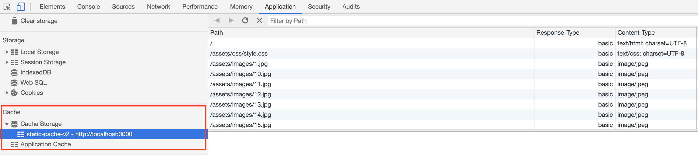
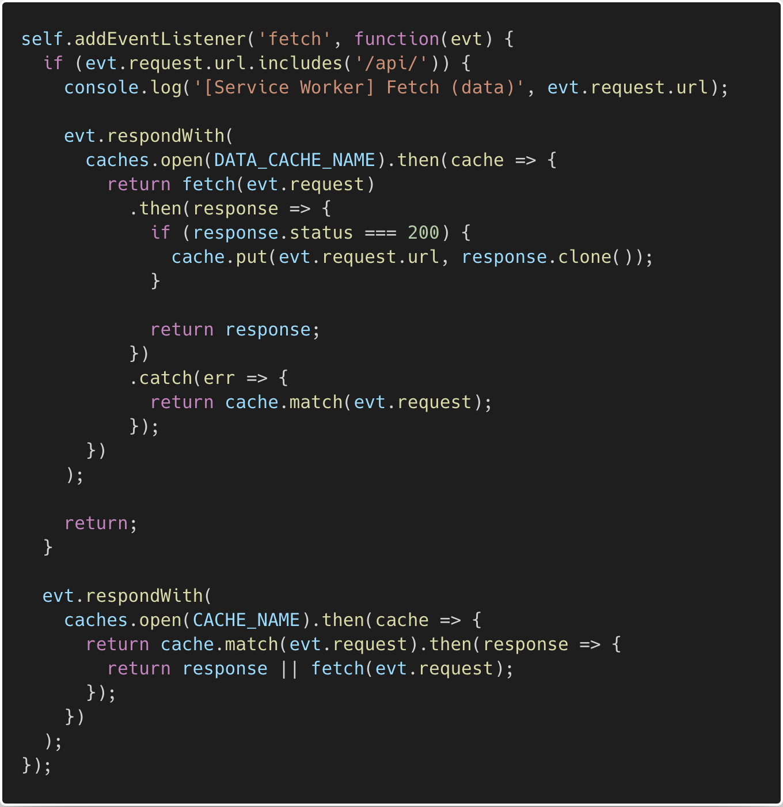
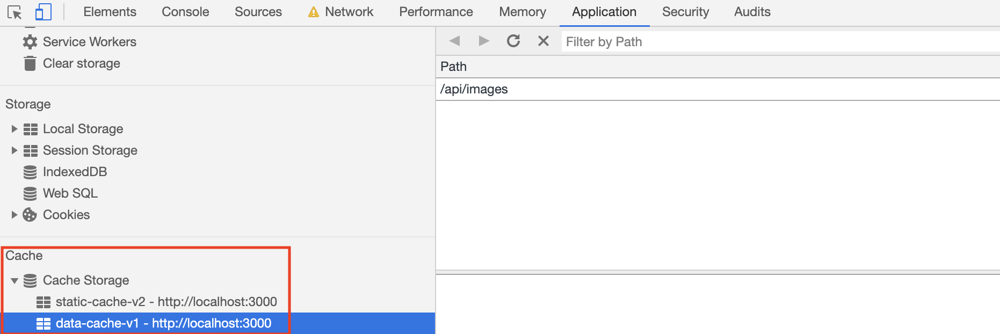
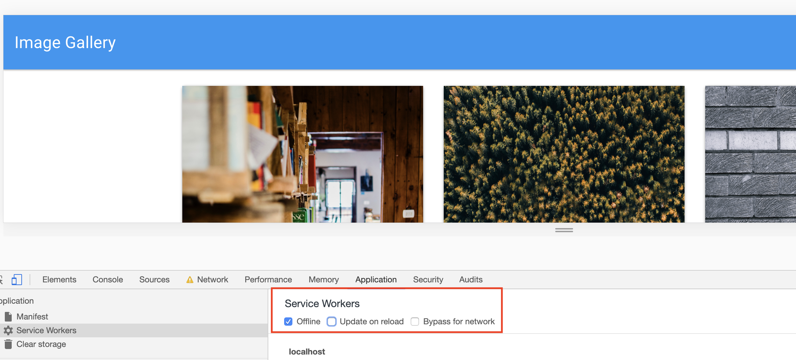

# The Offline Experience

In this activity you will be enabling functionality to allow your application to work offline.

## Instructions

* Open a terminal and start `mongod` if it isn't already running.

* Open another terminal and run the commands:

  * `npm install`

  * `npm run seed`

  * `npm start`

* Add the following code to your `service-worker.js` file.

* Copy/Type out the following code snippets when adding them to your application, it will help you solidify what you are doing!

* As you go through each step, keep your Chrome Develop tools open to monitor your progress and debug if needed.

  1. Uncomment the code to set up cache files in `service-worker.js`.

   

  2. Add code to install and register your service worker.

  ```js
  self.addEventListener('install', function(evt) {
    evt.waitUntil(
      caches.open(CACHE_NAME).then(cache => {
        console.log("Your files were pre-cached successfully!");
        return cache.addAll(FILES_TO_CACHE);
      })
    );

    self.skipWaiting();
  });
  ```

  3. If done successfully, you should see your static cache in your Application tab.

   

  4. Add code to activate the service worker and remove old data from the cache.

  ```js
  self.addEventListener("activate", function(evt) {
    evt.waitUntil(
      caches.keys().then(keyList => {
        return Promise.all(
          keyList.map(key => {
            if (key !== CACHE_NAME && key !== DATA_CACHE_NAME) {
              console.log("Removing old cache data", key);
              return caches.delete(key);
            }
          })
        );
      })
    );

    self.clients.claim();
  });
  ```

  5. Enable the service worker to intercept network requests.

  ```js
  self.addEventListener('fetch', function(evt) {
  // code to handle requests goes here
  });
  ```

  6. Serve static files from the cache. Proceed with a network request when the resource is not in the cache. This code allows the page to be accessible offline. (This code should be placed in the function handling the `fetch` event.)

  ```js
  evt.respondWith(
    caches.open(CACHE_NAME).then(cache => {
      return cache.match(evt.request).then(response => {
        return response || fetch(evt.request);
      });
    })
  );
  ```

  7. Type the remaining code to cache responses for requests for data. The function handling the `fetch` event should resemble the following:

    

    If done successfully you will see your data cache in your Application tab. At this point you should be able to put your application in offline mode for an offline experience.

    

    
