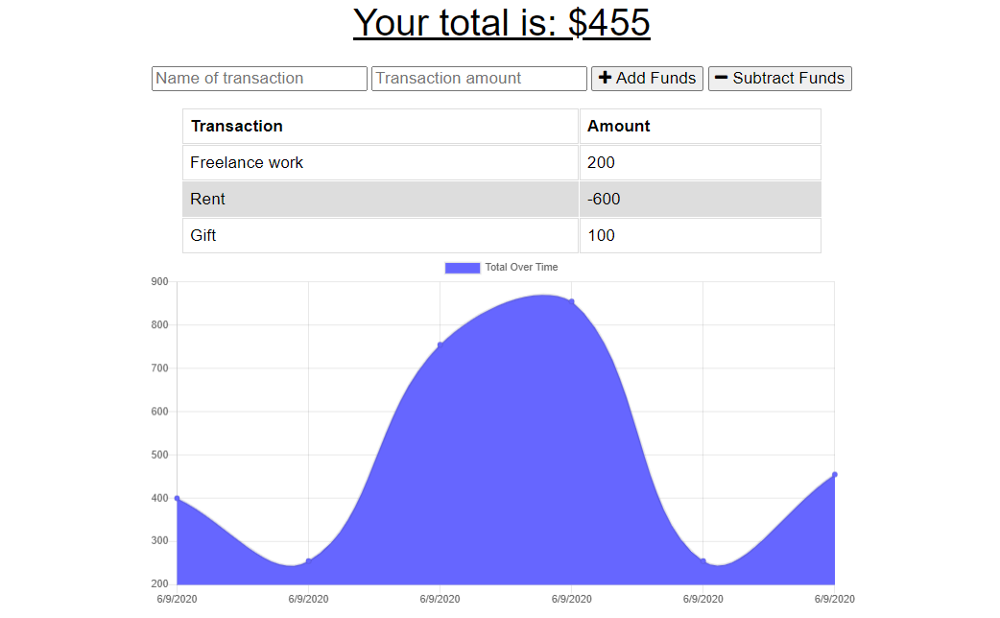

# 19 Progressive Web Applications (PWA): Budget Tracker

Giving users a fast and easy way to track their money is important, but allowing them to access that information at any time is even more important. Having offline functionality is paramount to the success of an application that handles users’ financial information.

Your challenge this week is to add functionality to an existing Budget Tracker application to allow for offline access and functionality. The user will be able to add expenses and deposits to their budget with or without a connection. When entering transactions offline, they should update the total when brought back online.

Before you start, clone the [starter code](https://github.com/coding-boot-camp/symmetrical-bassoon).


## User Story

```md
AS AN avid traveller
I WANT to be able to track my withdrawals and deposits with or without a data/internet connection
SO THAT my account balance is accurate when I am traveling 
```

## Acceptance Criteria

```md
GIVEN a Budget Tracker without an internet connection
WHEN the user inputs an expense or deposit
THEN they will receive a notification that they have added an expense or deposit
WHEN the user reestablishes an internet connection
THEN the deposits or expenses added while they were offline are added to their transaction history and their totals are updated
```

## Mock-Up

The following image shows the web application's appearance and functionality:




## Getting Started

Once you convert the existing Budget Tracker into a PWA, it should provide the following functionality:

* The ability to enter deposits offline

* The ability to enter expenses offline

* Offline entries should be added to the tracker when the application is brought back online


## Review

You are required to submit BOTH of the following for review:

* The URL of the functional, deployed application.

* The URL of the GitHub repository. Give the repository a unique name and include a README describing the project.

- - -
© 2020 Trilogy Education Services, a 2U, Inc. brand. All Rights Reserved.