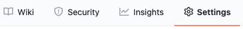
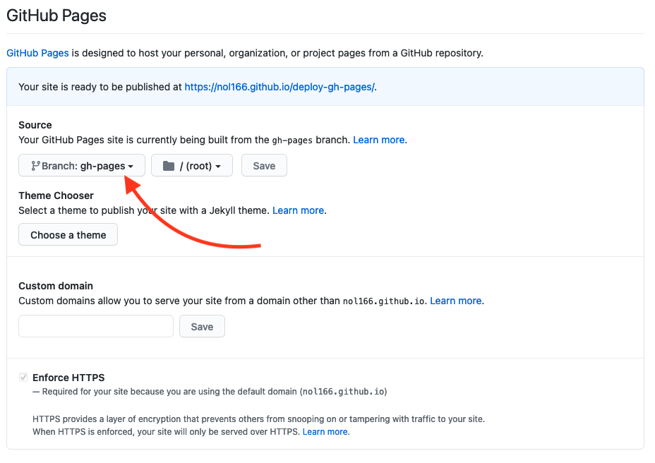
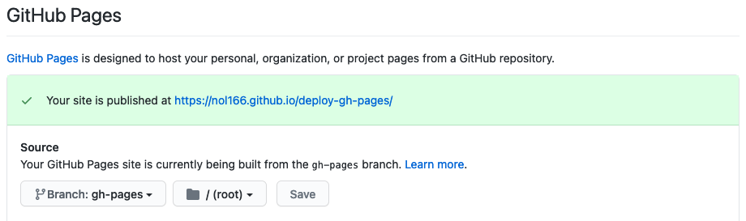

# Deploy React App to GitHub Pages

At this point in the course, you have spent some time immersed in React and have even created some React apps of your own. React can seem confusing at first, but the good news is that `create-react-app` gives you the tools to build applications from scratch. This guide will show you how to deploy your React app to GitHub Pages while preserving the file structure of your source files. 

Here are a few details to prepare you for this activity:

* The script you'll use is outlined in the `package.json` file for the React app. You will see it listed under the `scripts` section of the `package.json` for the `build` key-value pair.

* This command will output to a `/build` directory. This includes a `/build/static` directory that will contain all the required JavaScript and CSS files.

* Every file in this folder contains a unique hash of the file contents. The hash tells the browser how to download a fresh copy of the application every time you build it.

Now that we understand a little bit about what this command will do, let's put it into action and get the React app ready for GitHub Pages!

# Prepare the Repo

## Add Homepage to package.json

First we need to open the `package.json` file for the client and add an entry called `homepage`. The value of `homepage` should have `{username}` as your GitHub username, and `{repo-name}` as the name of the GitHub repository you created: 

```
https://{username}.github.io/{repo-name}
```

Your updated `package.json` should look something like this:

```text
{
  "name": "my-app",
  "version": "0.1.0",
  "private": true,
  "homepage": "https://myusername.github.io/my-app",
```

## Install gh-pages and Add Deploy Scripts

To publish your app, you need to install the `gh-pages` npm package. Additionally, you'll need to add a few more scripts to `package.json`. Start by simply adding the `gh-pages` dependency:

```sh
npm i gh-pages
```
**Note:** You will see another package manager called `yarn` suggested by `create-react-app`. `yarn` is very similar to `npm`, but for the sake of consistency we will stick with `npm`.

Now lets add the `predeploy` and `deploy` scripts to `package.json`. 

```text
  "scripts": {
    "predeploy": "npm run build",
    "deploy": "gh-pages -d build",
    "start": "react-scripts start",
    "build": "react-scripts build",
```

# Deploy the Site

Now is the time to deploy the React app to GitHub Pages. To do this, run the following command:

```sh
npm run deploy
```

# Check Project Settings

Go to the GitHub project settings by clicking the link shown in the following image:



Check that your source branch is `gh-pages`, as shown in the following image:



**Note:** Keep in mind that your page may take a minute or two to deploy. At first, the notification will appear in a blue color while being published.

Finally, let's refresh the page to make sure that the page has been published. This notification will appear in green, as shown in the following image:



Click on the URL to check that everything looks good.

## Reflection

You have successfully deployed your React application to GitHub Pages with just a few simple steps. While doing so, you learned about how the React deploy scripts work and how to prepare your repos for a `gh-page` deployment.

---
© 2021 Trilogy Education Services, LLC, a 2U, Inc. brand. Confidential and Proprietary. All Rights Reserved.
