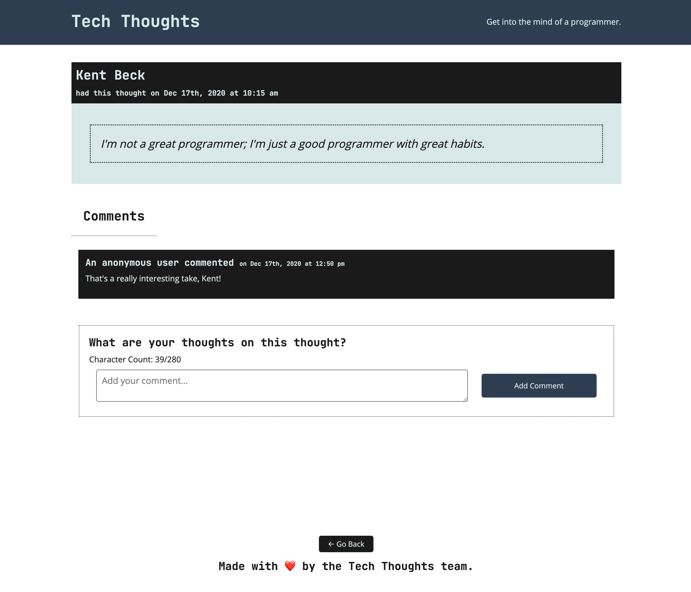

# 🏗️ Implement Single-Thought Page Display

Work with a partner to implement the following user stories:

* As a user, I want to view individual thoughts and a list of comments.

* As a user, I want to be able to bookmark a thought's page so I can come back and read more comments.

## Acceptance Criteria

The activity is complete when the following criteria are met:

* When I select a thought on the homepage, I am taken to that thought's page to view its comments without reloading the page.

* When I visit the thought directly in the browser, I am taken to that thought's page to view its comments.

## Assets

The following image demonstrates the web application's appearance and functionality:

---

## 💡 Hints

* How can the value of the `to` prop in each thought's `<Link>` component help us define our route?

* How can we define a route with a parameter using React Router?

* How can the `useParams()` hook be used to retrieve data to be used in the `useQuery()` hook?

## 🏆 Bonus

If you have completed this activity, work through the following challenge with your partner to further your knowledge:

* Which browser API does React Router leverage?

Use [Google](https://www.google.com) or another search engine to research this.

---

© 2021 Trilogy Education Services, LLC, a 2U, Inc. brand. Confidential and Proprietary. All Rights Reserved.
