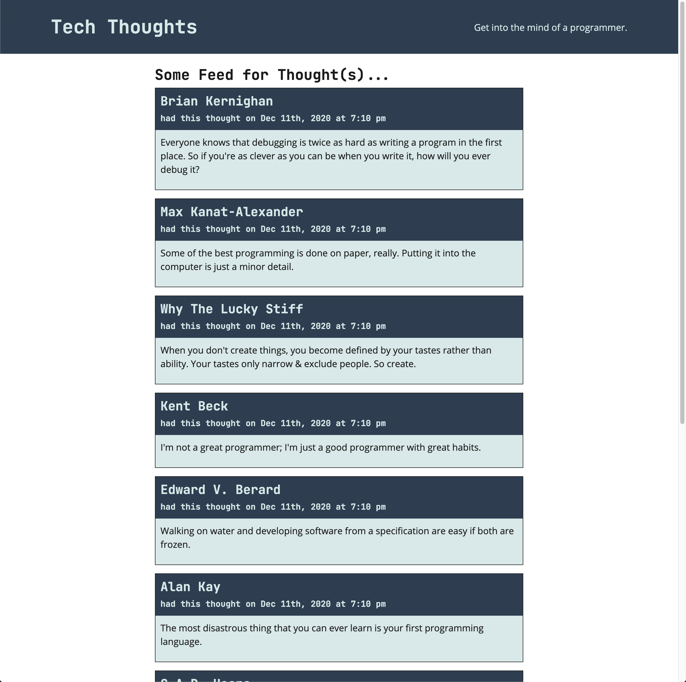

# 🏗️ Implement Query to Retrieve Thought Data

Work with a partner to implement the following user story:

* As a user, when I visit the application's homepage, I am shown a list of thoughts.

## Acceptance Criteria

The activity is complete when it meets the following criteria:

* The application's homepage displays all thought data queried from the API in a list.

* The homepage renders a loading screen when the thought data has not returned from the API yet.

## Assets

The following image demonstrates the web application's appearance and functionality:

---

## 💡 Hints

* Where can a query be created to be used anywhere in our application?

* What properties returned from `useQuery()` can be used to determine if the request hasn't completed yet?

* How can we seed the database so there's data to query?

## 🏆 Bonus

If you have completed this activity, work through the following challenge with your partner to further your knowledge:

* What React API is the Apollo Client provider functionality built with?

Use [Google](https://www.google.com) or another search engine to research this.

---

© 2021 Trilogy Education Services, LLC, a 2U, Inc. brand. Confidential and Proprietary. All Rights Reserved.
