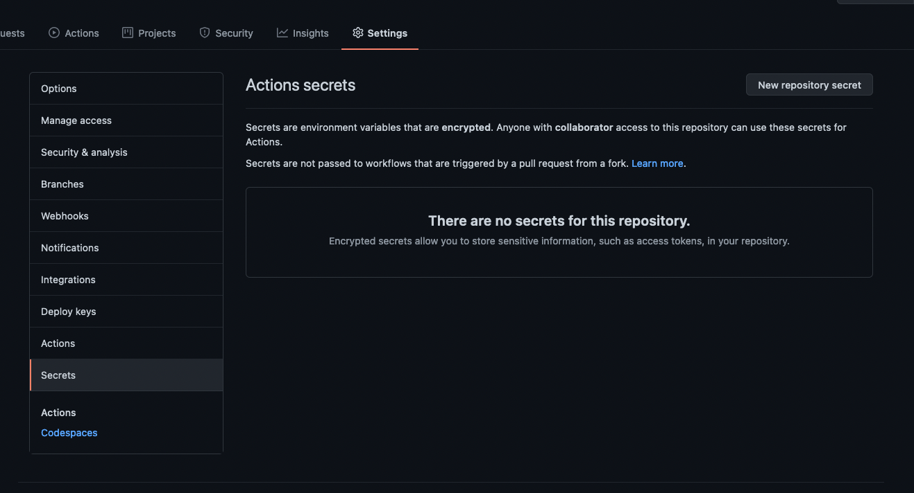
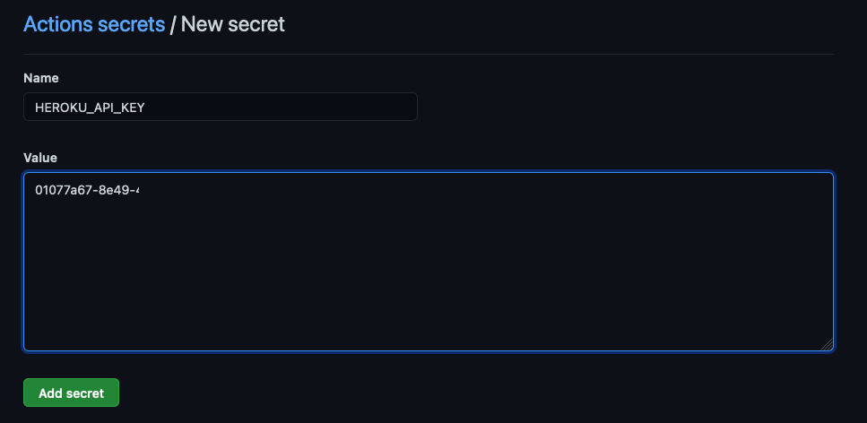
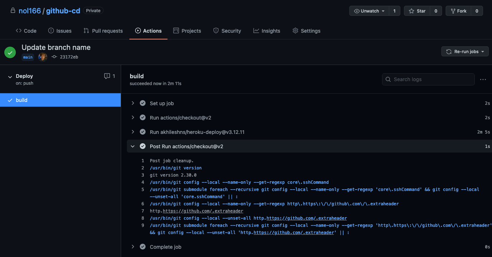
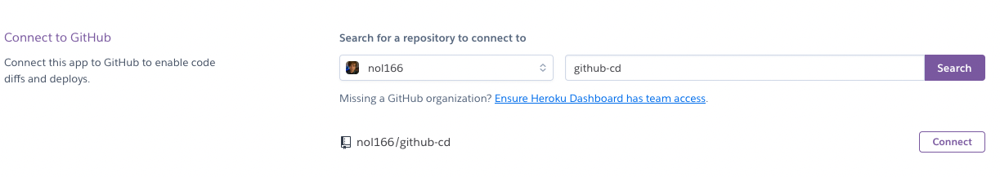
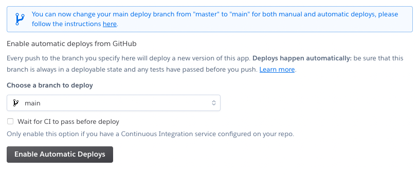
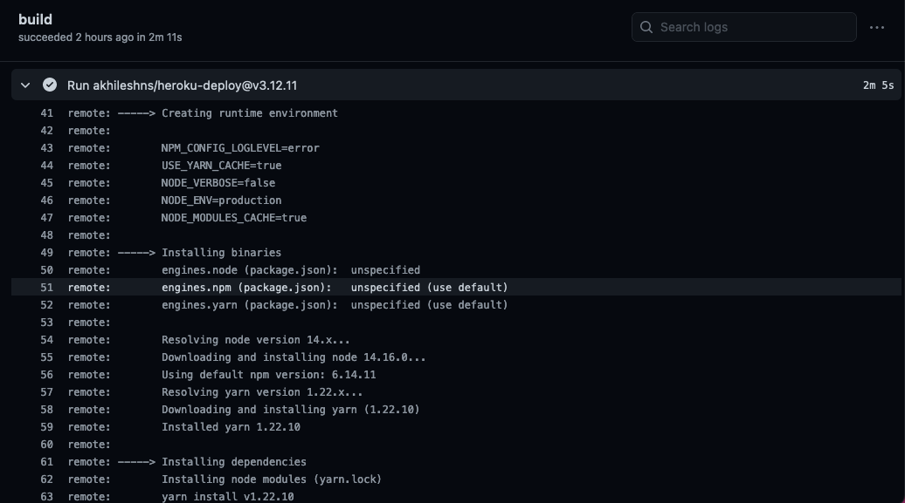

# CI/CD Using GitHub Actions

In this guide, we will explore how applications are constantly updated and released to the public smoothly and seamlessly: we will revisit GitHub Actions to set up automated continuous deployment of an application to Heroku. **Continuous deployment (CD)** describes the automated process by which new features and bug fixes are delivered to end users.

CD often accompanies **continuous integration (CI)**, which describes when developers merge all their existing copies of code into a shared branch several times a day. As changes to a repository compound on each other, developers encounter more complications when submitting their work. The **CI/CD pipeline**, then, keeps the codebase up to date and evolving with the developers that work on it.

Although this particular guide covers continuous deployment with Heroku, you can use the same process for other platforms, such as Netlify, Vercel, and many others. There is no shortage of cloud providers that you can choose from to deploy your applications -- and because technologies are constantly emerging and evolving, developers need to be well-rounded and adaptable to new platforms.

## Create the App

First we will create an app that will eventually be used by GitHub Actions to automatically deploy to Heroku.

1. Create a new boilerplate React application in a directory of your choice. After the app has been created, navigate to that directory, as follows:

    ```sh
    npx create-react-app github-cd
    cd github-cd
    ```

2. Navigate to GitHub and create a new repository of the same name. Opt out of the README and `.gitignore` initialization.

3. Copy the remote URL from your newly created GitHub repository and add it to your current project, as follows:

    ```sh
    git remote add origin <github_remote_url>
    ```

## Create Procfile and main.yml

The `Procfile` is a small text file that will tell Heroku which command to execute to start your app.

1. Create a `Procfile` at the root of the project directory, with a `web` command that tells Heroku which npm script needs to run for the application to start. We can do this quickly, from the command line, with the following command: 

    ```sh
    echo "web: npm start" > Procfile
    ```

   * The `echo` command outputs the string that is passed inside the quotation marks.
   
   * The `>`, or the **redirection operator**, means that anything inside the quotes will be redirected to the destination that follows the `>`. In this case, we inject the string into `Procfile`. The file doesn't exist, so Bash creates one.

2. Create a new folder called `.github` and another folder inside of it called `workflows`. After this, we will create the `main.yml` file, defining the workflow for GitHub. See the following example:

      ```sh
      mkdir .github && cd .github
      mkdir workflows && cd workflows
      touch main.yml
      ```

    **Note**: Any file prefixed by a `.` is hidden to the operating system. Running `ls` won't show those files or folders. To see them, run `ls -a`. The `-a` flag stands for "all."

3. Return to the root of your project directory and open your code editor, as follows:

    ```sh
    cd ../..
    code .
    ```

4. In your code editor, open `.github/workflows/main.yml` and add the following content:

    ```yml
    name: Deploy

    on:
      push:
        branches:
          - main

    jobs:
      build:
        runs-on: ubuntu-latest
        steps:
          - uses: actions/checkout@v2
          - uses: akhileshns/heroku-deploy@v3.12.11
            with:
              heroku_api_key: ${{secrets.HEROKU_API_KEY}}
              heroku_app_name: "Enter-Heroku-App-Name"
              heroku_email: "YOUR EMAIL HERE"
    ```

    * **yml** is a human-readable language intended for config files that are used with programs that store or transmit data. Think of yml, or **YAML**, as a more readable version of XML or JSON.

    * The first part of the file tells GitHub that when a push to the branch (`main`) occurs, some work should be performed. Update the word `main` in the following code if your default branch name is different:

      ```yml
      on:
        push:
          branches:
            - main
      ```

    * The latter half of this file tells GitHub that the action should be run on a container using the latest version of Ubuntu, a popular Linux distribution. A **container** is a virtual machine that runs on a server either locally or remotely. In this case, the container is being hosted by GitHub. Refer to the following example:

      ```yml
      jobs:
        build:
          runs-on: ubuntu-latest
      ```

    * The `main.yml` file also specifies some actions, to check out the main branch and to deploy to Heroku. The `with` portion passes in some variables to the Heroku action that contains your API key, your Heroku app name, and the email associated with your Heroku account. It should look like the following example:

      ```yml
          steps:
            - uses: actions/checkout@v2
            - uses: akhileshns/heroku-deploy@v3.12.11
              with:
                heroku_api_key: ${{secrets.HEROKU_API_KEY}}
                heroku_app_name: "Enter-Heroku-App-Name"
                heroku_email: "YOUR EMAIL HERE"
      ```

    * You can specify multiple workflows that get triggered by different events on different branches. For example, if you want to run tests every time someone makes a pull request to `develop`, you can set up a workflow for that!

## Heroku Steps

Now we need to make a new Heroku app to deploy to. 

1. First, navigate to the [Heroku dashboard](https://dashboard.heroku.com/apps) and select New in the top right. Next, choose App and accept the randomly generated app name provided for you. You can set a custom one, but the one you want might already be in use.

2. After you choose a name for your Heroku app, make sure to update `main.yml` with that name and the email address associated with your Heroku account. After you have entered that information, move on to the next step.

3. After creating your app, navigate to the [Heroku Account Dashboard](https://dashboard.heroku.com/account) and locate the API Key section. Select Reveal and then copy the key to your clipboard or paste it somewhere easily accessible. It should look something like the following image:

    

## GitHub Steps

1. Navigate to the repository on GitHub and then select Settings for the repository (not your account settings).

2. Select Secrets from the menu on the left, as shown in the following image:

    

3. Select "New Repository Secret". Name the new secret "HEROKU_API_KEY" and then paste in the API key that you copied earlier from Heroku, as shown in the following image:

    

## Finishing Up

* Once you save your secret, double-check that you updated your `main.yml` file with the name of your Heroku app and the address associated with your account.

* Finally, we need to add and commit the changes and push to GitHub. Once we do this, we will be able to automatically deploy to Heroku using GitHub Actions.

* Commit your changes to the `.github/` directory as well as the `Procfile`, as follows:

  ```sh
  git add -A
  git commit -m "Add user specific information to workflow"
  git push origin main
  ```

Any changes that are made to your main branch will invoke your CD workflow on GitHub, as shown in the following image:



## The One-Click Solution (Optional)

**Important**: The following step is an alternative to creating a workflow. Setting up both the one-click solution and a workflow is redundant and not recommended. 

With continuous deployment, you can be as granular or as hands-off as you want. Heroku offers a button in your project settings that does something similar to what you just accomplished using Actions. You can use it by following these steps.

1. Open the dashboard for your Heroku app and then select Deploy.

2. Look for a section titled Deployment Method and click the GitHub button.

3. You will be asked to "Connect to GitHub". Click this button -- doing so will create an OAuth token for use between Heroku and your GitHub account.

4. Select Authorize.

5. You will be taken back to the Heroku deployment settings for your app. You will notice a search bar for your GitHub repositories. Search for the project name and then click Connect, as shown in the following image:

    

6. Next, click Enable Automatic Deploys, as shown in the following image:

    

## What Happens in the Background

Now that you've set up continuous deployment through GitHub Actions or through Heroku's automatic deploy, every time you make a change to the `main` branch of the GitHub repository, a new deployment will be triggered by GitHub or Heroku, depending on which workflow you chose.

Look at the Actions tab while your application is building. You can actually see the commands as they run inside the container! It will look something like the following image:

  

## Conclusion

Congratulations on setting up continuous deployment for your app! It is important to understand how to set up workflows for both your group projects and your future job -- and it can be quite satisfying to push your code to the main branch and watch the deployment log on GitHub. Happy coding!

## Helpful Resources

* [YAML documentation](https://yaml.org/)

* [GitHub documentation on continuous integration](https://docs.github.com/en/actions/guides/about-continuous-integration) 

* [GitHub documentation on GitHub Actions](https://docs.github.com/en/actions) 

* [Heroku documentation on automatic deploys](https://devcenter.heroku.com/articles/github-integration#automatic-deploys)

* [Heroku documentation on Procfile](https://devcenter.heroku.com/articles/procfile)

---
© 2021 Trilogy Education Services, LLC, a 2U, Inc. brand. Confidential and Proprietary. All Rights Reserved.
