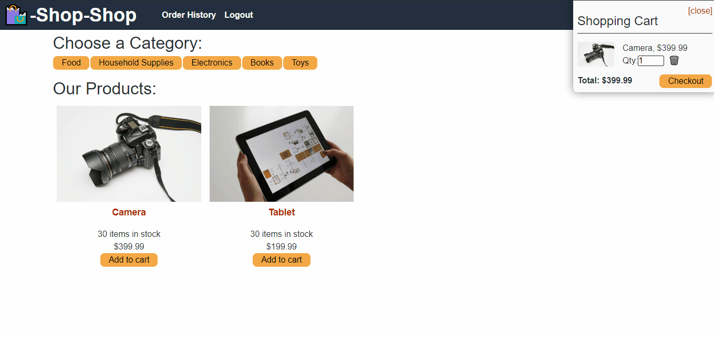

# 22 State: Redux Store

Throughout this module, you learned how to manage global state using React’s Context API. The Context API is quickly gaining traction in the development world as a worthy alternative or perhaps even successor to additional libraries that have been used to manage global state in tandem with React, such as Flux or MobX. In spite of this, Redux remains the industry standard for managing complex state in a large-scale React application, and it’s very likely that you’ll encounter it while working as a developer.

Your challenge this week is to refactor the e-commerce platform that you created in this module, replacing the way it handles complex state management using the Context API with [Redux](https://redux.js.org/), the open-source JavaScript library that it’s emulating. You won’t have to change too much to refactor the application, but you will need to read through the Redux documentation to find the right information. We’ve provided some guidelines to point you in the right direction in the Getting Started section below.

> **On the Job:** Web developers are frequently asked to dive into a new technology, sifting through documentation to find the right information that matches the specific problem they’re trying to solve. As you get ready to enter into your first development role, use this Challenge as a transition into a skill you’ll be using all the time over the course of your career.


## User Story

```md
AS a senior engineer on an e-commerce platform
I WANT my platform to use Redux to manage global state instead of the Context API
SO THAT my website's state management is taken out of the React ecosystem
```


## Acceptance Criteria

```md
GIVEN an e-commerce platform that uses Redux to manage global state
WHEN I review the app’s store
THEN I find that the app uses a Redux store instead of the Context API
WHEN I review the way the React front end accesses the store
THEN I find that the app uses a Redux provider
WHEN I review the way the app determines changes to its global state
THEN I find that the app passes reducers to a Redux store instead of using the Context API
WHEN I review the way the app extracts state data from the store
THEN I find that the app uses Redux instead of the Context API
WHEN I review the way the app dispatches actions
THEN I find that the app uses Redux instead of the Context API
```


## Mock-Up

The following animations show the web application's appearance and functionality:

 





### Getting Started

Read through the Redux [basic tutorial](https://redux.js.org/basics/basic-tutorial) to add Redux to your application. Note that the docs will refer to additional packages that you'll need to complete this implementation.

> **Important:** Make sure you look through ALL the documentation, because there are newer methods available that can make these tools much easier to implement. Remember that React has gone through several iterations, and some React + Redux tutorials that you find will assume you aren't using Hooks.


## Review

You are required to submit BOTH of the following for review:

* The URL of the functional, deployed application.

* The URL of the GitHub repository. Give the repository a unique name and include a README describing the project.

- - -
© 2021 Trilogy Education Services, LLC, a 2U, Inc. brand. Confidential and Proprietary. All Rights Reserved.
