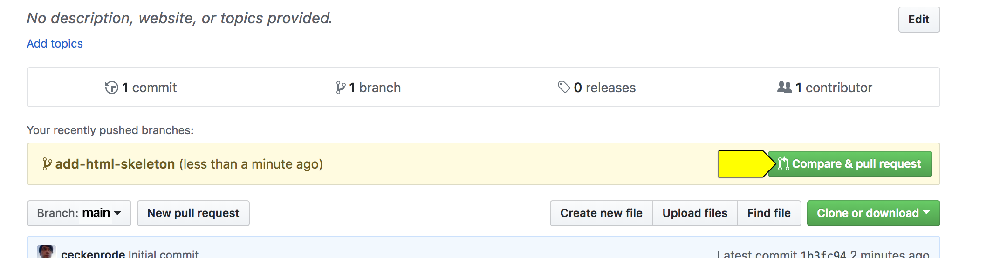
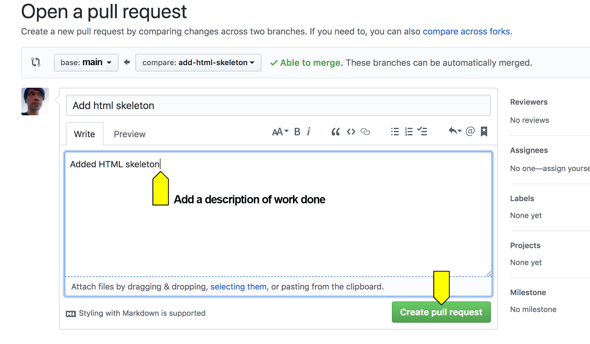
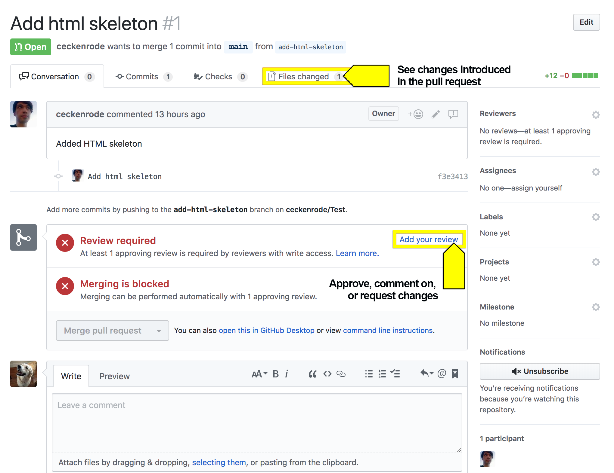
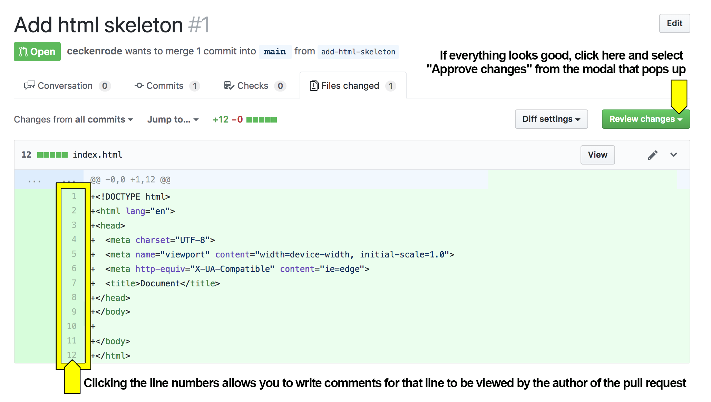
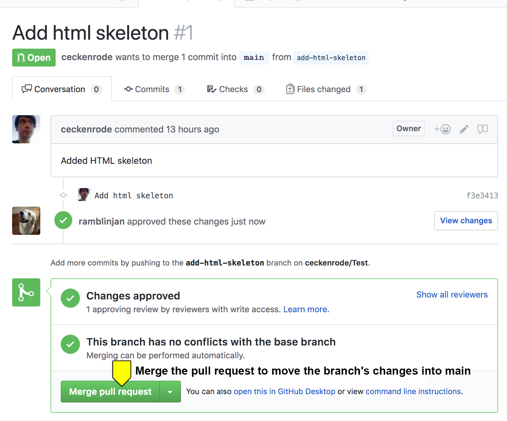

# Module 07 Virtual Class (Recommended): Project 1

## Overview 

In today's recommended virtual class, students will be introduced to Agile methodologies, configure repositories for collaborative development, and work collaboratively with branches in Git. 

## Learning Objectives

By the end of class, students will be able to:

* Explain Agile methodologies 

* Configure a repository for collaborative development

* Work collaboratively with branches in Git


## Instructor Notes

* In today's class you will demonstrate protecting the master branch in a repository, working with branches, and opening pull requests. You may want to create a repository and simple demo project to do so. 

* If you finish activities early, use the remainder of class to work on projects. You may not need to review the activities today.


## Time Tracker 

| Start  | #  | Activity Name                               | Duration |
|---     |--- |---                                          |---       |
| 7:00PM | 1  | Introduction                                | 0:05     |
| 7:05PM | 2  | Everyone Do: Career Connection              | 0:20     |
| 7:25PM | 3  | Instructor Demo: Create a Repository        | 0:05     |
| 7:30PM | 4  | Student Do: Create a Repository             | 0:15     |
| 7:45PM | 5  | Instructor Review: Create a Repository      | 0:10     |
| 7:55PM | 6  | Instructor Demo: Branches & Pull Requests   | 0:05     |
| 8:00PM | 7  | Student Do: Branches & Pull Requests        | 0:15     |
| 8:15PM | 8  | Instructor Review: Branches & Pull Requests | 0:10     |
| 8:25PM | 9  | Recap                                       | 0:05     |
| 8:30PM | 10 | Office Hours                                | 0:30     |
| 9:00PM | 11 | End                                         | N/A      |

## Slide Deck

[07.1 Project 1](https://docs.google.com/presentation/d/1BFQmjVz7UDlGclA6I7MVow-fF4ppEB6AxzaxAm7nQIk/edit?usp=sharing)

---

## Class Instructions 

### 1. Introduction (5 min)

* Welcome students to class.

* Direct students to post individual questions in the Zoom chat to be addressed by TAs and/or at the end of class.

* Ask the class the following questions (☝️) and call on students for the answers (🙋):

    * ☝️ How are you feeling about your progress so far?

    * 🙋 We are adding another layer to our full-stack skill set. It's important to look back and see what we accomplished, and acknowledge that it's a lot! It’s also okay to feel overwhelmed as long as you don’t give up.

    * ☝️ How comfortable do you feel with this topic? 

    * 🙋 Let's do "fist to five" together. If you are not feeling confident, hold up a fist (0). If you feel very confident, hold up an open hand (5).


### 2. Everyone Do: Career Connection (20 min)

* Present the [Project 1 Slide Deck](https://docs.google.com/presentation/d/1BFQmjVz7UDlGclA6I7MVow-fF4ppEB6AxzaxAm7nQIk/edit?usp=sharing) and use the question prompts to facilitate the following discussion:

  * **What is a project?**: We're about to begin our first project. But first, what is a project?

  * **Project**: A project is "any undertaking, carried out individually or collaboratively and possibly involving research or design, that is carefully planned (usually by a project team) to achieve a particular aim." [Wikipedia: Project](https://en.wikipedia.org/wiki/Project)

  * **How do we carefully plan a project?**: 

  * **Project management**: the practice of initiating, planning, executing, controlling, and closing the work of a team to achieve specific goals and meet specific success criteria at the specified time. The primary challenge of project management is to achieve all of the project goals within the given constraints. [Wikipedia: Project management](https://en.wikipedia.org/wiki/Project_management)

  * **What is the definition of agile?**: In general, what does it mean to be _agile_?

  * **agile [ aj-uhl, -ahyl ]**: According to dictionary.com, agile is "quick and well-coordinated in movement". 

  * **What is agile software development?**: What do we think "agile" means in terms of software development?

  * **Agile software development**: Agile software development is an iterative approach to developing software. Teams deliver value to their customers faster by working incrementally rather than working towards a big launch. Teams improve and respond to change by continuously evaluating project plans, requirements and user needs. 

  * **What is iterative development?**: What is _iteration_? If iteration is the repetition of a process in order to generate a sequence of outcomes, what is _iterative development_? 

  * **Iterative Development**: In an iterative approach to development, working software is the primary measure of progress. Our goal is to build functional applications, even if they are very simple, like a skateboard. If we set out to build a sports car, we may never get there and we will have unhappy customers along the way.

  * **What is an MVP?**: It's not _most valuable player_.

  * **Minimum Viable Product**: A minimum viable product is a product with just enough features to satisfy early customers and provide feedback for future product development. [Wikipedia: MVP](https://en.wikipedia.org/wiki/Minimum_viable_product)

  * **How do we determine an MVP?**: How do we know what our minimum viable product is?

  * **Determining a Minimum Viable Product**: There are a lot of approaches to defining a minimum viable product, but we can simplify it to three questions: 1) who is your audience?; 2) what is the problem that the product will address?; 3) how does the product solve that problem?

  * **What is a user story?**: 

  * **User stories**: In software development and product management, a user story is an informal, natural language description of one or more features of a software system. User stories are often written from the perspective of an end user or user of a system. [Wikipedia: User story](https://en.wikipedia.org/wiki/User_story)

  * **What is acceptance criteria?**: 

  * **Acceptance criteria**: Acceptance criteria define the boundaries of a user story and are used to confirm when a story is completed and working as intended. [Wikipedia: Acceptance criteria](https://en.wikipedia.org/wiki/User_story#Acceptance_criteria)

  * **What is daily scrum?**: 

  * **Stand-up Meetings**: Stand-up meetings are used to hold teams accountable to each other. Team members make commitments to work on aspects of the project and report out progress. Stand-up meetings are useful in identifying issues as they arise and developing plans to resolve them. There are generally three questions each team member answers in a stand-up: 1) What was accomplished?; 2) What are your goals?; 3) Are there any obstacles to achieving your goals? [Wikipedia: Stand-up meeting](https://en.wikipedia.org/wiki/Stand-up_meeting)

  * **Project Timeline**: On the first day, we'll divide into groups, write a user story, create a wireframe, create a user flow diagram, and submit a project proposal for approval. We will continue to work on project development until project presentations on the sixth day.

  * **Get Professional**: Remember, projects are your portfolio pieces. Use project week as an opportunity to push yourself and prove your knowledge. Keep you MVP simple and add features as you go to avoid feature creep.

  * **Project Requirements**: 

  * **Presentation Requirements**:

  * **Project Metrics**: Your project will be evaluated on its concept, design, functionality, collaboration, and presentation.

  * **API Suggestions**: It is recommended that you use an API that: Allows CORS, requires simple or no authentication, uses JSON, is well documented.

  * **Today's Project Checklist**: 

* Answer any questions before proceeding to the next activity.

### 3. Instructor Demo: Create Repository (5 min) 

* Navigate to [GitHub](https://github.com) in your browser and demonstrate the following: 
    
    * If we navigate to github.com, we find several options for creating a new repository. 

    * When we navigate to the "Settings" tab, we see several menu options, including "Collaborators" on the left.

    * 🔑 If we navigate to the "Collaborators" page we can invite group members to be project collaborators by entering their Github usernames one at a time. Each invited group member should receive an email they must open to accept the invitation.

    * When we navigate back to the repository's "Settings" page, we also see a "Branches" menu item in the left sidebar.

    * If we navigate to "Branches", we will find a "Branch Protection Rules" section. We want to select "master" from the dropdown.

    * 🔑 When we are presented with some options, we want to check the following: "Protect this branch", "Require pull request reviews before merging", and "Include administrators". 

* Ask the class the following questions (☝️) and call on students for the answers (🙋):

    * ☝️ Why do we want to protect the `master` branch? 

    * 🙋 * If completed successfully, no one should be able to push directly to the master branch. Instead, all changes must be made in the form of pull requests that are to be reviewed by another group member.

* Answer any questions before proceeding to the next activity.


### 4. Student Do: Create Repository (15 min) 

* Divide students into breakout rooms.

* Direct students to the activity instructions found in `01-Stu_Create-Repository/README.md`.

    ```md
    # Create a Repository and Protect Master Branch

    In this activity, you will create a Github repository, add group members as collaborators, and protect your repository's master branch.

    ## Instructions

    * One group member should create a new Github repository. Don't worry about the project name now; this can be changed later.

    * From the repository's main page, click the "Settings" tab.

    * Once in the repository's settings, select the "Collaborators" menu item on the left.

    * From the "Collaborators" page invite your group members to be project collaborators by entering their Github usernames one at a time.

    * Each invited group member should receive an email they must open to accept the invitation.

    ⚠️ Only one member per project group needs to complete the following: 

    * Navigate back to the repository's "Settings" page and then select "Branches" from the left sidebar.

    * Under "Branch Protection Rules" select "master" from the dropdown.

    * You should be presented with some options, check off the following:

      * "Protect this branch"

      * "Require pull request reviews before merging"

      * "Include administrators"

      

    * If completed successfully, no one should be able to push directly to the master branch. Instead, all changes must be made in the form of pull requests that are to be reviewed by another group member.

    ### Hints

    * Ask your instructor or TA if you get stuck!
    ```

### 5. Instructor Review: Create Repository (10 min) 

* Bring students back from breakout rooms. 

* Repeat the process of creating a repository and protecting the `master` branch if necessary.

* Answer any questions before proceeding to the next activity.


### 6. Instructor Demo: Branching and Pull Requests (5 min) 

* Navigate to the repository from the previous activity and demonstrate the following: 

    * Clone the project repo onto your computer and `cd` into it.

    * 🔑 Run the following command in your terminal to create and checkout to a new branch:

    ```
    git checkout -b add-html-skeleton
    ```

    * We should now be on a new branch named "add-html-skeleton". In order to verify this worked, run the following command in your terminal:

    ```
    git branch
    ```

    * We should see two branches listed: `master` and `add-html-skeleton`. The `add-html-skeleton` branch should have an asterisk to the left of it. This indicates that this is the branch you're currently on.

    * 🔑 At the root of the repo, create a new file named `index.html`. Inside this file, add code for a basic HTML skeleton and save.

    * 🔑 In your terminal, add and commit the changes. Then push up your code by running following in your terminal:

    ```
    git push origin add-html-skeleton
    ```

    * This should push up your code to to GitHub on a branch with the same name (`add-html-skeleton`).

    * 🔑 Go to the main repo page at github.com and click "Compare & pull request".

    * On the next screen, add a description of the work that was done and click the "Pull Request" button.

    * If completed successfully, we should see the pull request listed under the repo's "Pull request" tab.

    * 🔑 Now go to your GitHub repo's main page and go to the "Pull request" section. Select the `add-html-skeleton` pull request from the list.

    * At the next page select the option to see the "Files changed".

    * You should be presented with all of the files that were changed in this PR.

    * If there are any changes you would like made, you can click the line number to leave a comment the PR author will see and should address before approval. Otherwise click "Review changes" and approve the PR. 

    * 🔑 Click the "Merge pull request" button to add the branch's changes into master. Once complete you can delete the feature branch from your machine by running the following in your terminal:

    ```
    git branch -D add-html-skeleton
    ```

    * Remember to use `git pull` on your master branch to update it.

* Ask the class the following questions (☝️) and call on students for the answers (🙋):

    * ☝️ Why do we want to review pull requests? 

    * 🙋 To ensure the code to be merged is functional and does not create conflicts.

* Answer any questions before proceeding to the next activity.


### 7. Student Do: Branching and Pull Requests (15 min) 

* Divide students into breakout rooms.

* Direct students to the activity instructions found in `02-Stu_Branching-Pushing/README.md`.
    
    ```md
    # Git Branching and Pull Requests

    In this activity, we will create a new branch, implement a feature, and then submit a pull request back into master. We will also cover reviewing pull requests and merging them into master.

    # Instructions

    ## Part I: Branching and Submitting a Pull Request

    In this section, we will create a branch, add a feature, and submit a pull request. **Only one group member should complete this section, everyone else should observe.**

    * Clone your project repository onto your computer and `cd` into it.

    * Run the following command in your terminal to create and checkout to a new branch:

    ```git
    git checkout -b add-html-skeleton
    ```

    * You should now be on a new branch named "add-html-skeleton". In order to verify this worked, run the following command in your terminal:

    ```
    git branch
    ```

    * You should see two branches listed: `master` and `add-html-skeleton`. The `add-html-skeleton` branch should have an asterisk to the left of it. This indicates that this is the branch you're currently on.

    * At the root of the repository, create a new file named `index.html`. Inside this file, add code for a basic HTML skeleton and save.

    * In your terminal, add and commit the changes. Then push up your code by running the following command in your terminal:

    ```
    git push origin add-html-skeleton
    ```

    * This should push up your code to to GitHub on a branch with the same name (`add-html-skeleton`).

    * Go to the main repository page at github.com and you should see the following:

    

    * Click "Compare & pull request".

    * On the next screen, add a description of the work that was done and click the "Pull Request" button.

    

    * If completed successfully, you should see the pull request listed under the repository's "Pull request" tab.

    

    ## Part II: Reviewing a Pull Request

    In this section, we will review the pull request from Part I and merge it into master. **A different project member should complete this section while others observe**.

    * Clone the repository to your computer if you haven't already done so and `cd` into it.

    * First you will want to test the changes introduced by the `add-html-skeleton` branch locally. In order to examine the new branch on your local machine, run the following commands in your terminal:

    ```
    git fetch
    ```

    ```
    git checkout -b add-html-skeleton origin/add-html-skeleton
    ```

    * This code should bring the copy of the `add-html-skeleton` branch that's on GitHub onto your computer. 

    * Make sure this worked by verifying that there's an `index.html` file in your local repository.

    * Normally you'd run the code here to make sure everything works properly.

    * Check back out to your local `master` branch by running the following in your terminal:

    ```
    git checkout master
    ```

    * Now go to your GitHub repository's main page and go to the "Pull request" section. Select the `add-html-skeleton` pull request from the list.

    

    * At the next page select the option to see the "Files changed".

    

    * You should be presented with all of the files that were changed in this PR.

    

    * If there are any changes you would like made, you can click the line number to leave a comment the PR author will see and should address before approval. Otherwise click "Review changes" and approve the PR. You should be taken to the following screen:

    

    * Click the "Merge pull request" button to add the branch's changes into master. Once complete you can delete the feature branch from your machine by running the following in your terminal:

    ```
    git branch -D add-html-skeleton
    ```

    * Remember to use `git pull` on your master branch to update it.

    ### Hints

    * Ask an instructor or TA if you get stuck or have any questions!
    ```

### 8. Instructor Review: Branching and Pull Requests (10 min) 

* Bring students back from breakout rooms. 

* Repeat the process of creating a branch and pull request if necessary.

* Answer any questions before proceeding to the next activity.


### 09. Recap (5 min)

* Ask the class the following questions (☝️) and call on students for the answers (🙋):

    * ☝️ What topics did we cover today? What are the main takeaways?

    * 🙋 We covered agile project management and collaborative workflow using git branches and pull requests. 

    * ☝️ You can now use the remaining time to work on your projects with your group. **Remember** next week's Required class is when everyone will present their projects, so be ready for that!

    * ☝️ You are also encouraged to continue to work on algorithms throughout this week.


### 10. Office Hours (30 min)

* Announce Office Hours and invite students to stay on the Zoom and continue working on their project while they have live support from instructional staff. 


### 11. End

How did today’s lesson go? Your feedback is important. Please take 5 minutes to complete [this anonymous survey](https://forms.gle/3LozVjherGH83aG17)

---
© 2020 Trilogy Education Services, LLC, a 2U, Inc. brand.  Confidential and Proprietary.  All Rights Reserved.
