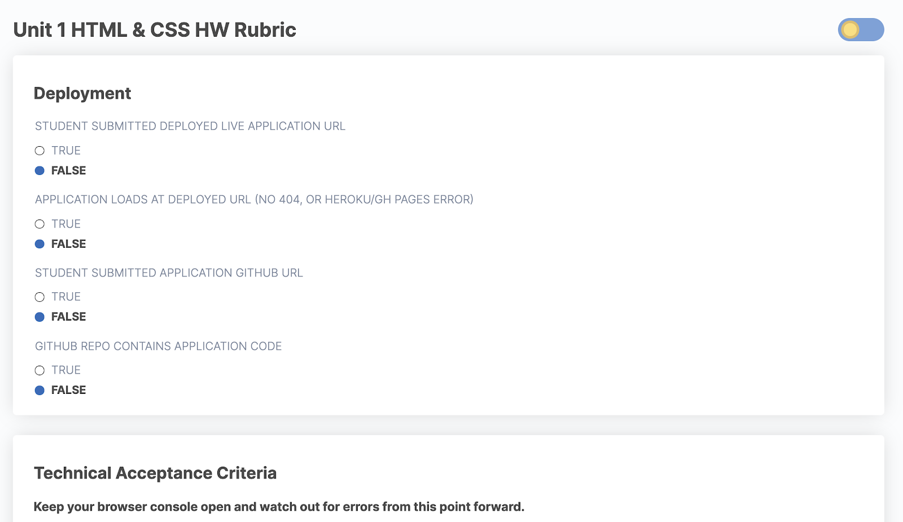
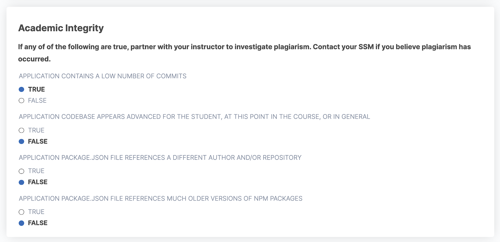
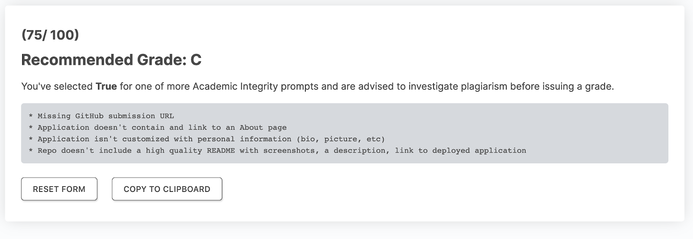

# Grading Rubrics

To ensure fast and consistent grading, use the corresponding rubric HTML file for each assignment.

Each rubric includes prompts that should be answered to determine a suitable assignment grade. Prompts are grouped into different categories such as "Deployment" and "Technical Acceptance Criteria":

The final category of prompts in each rubric is "Academic Integrity":

Historically, these have been indicators of possible plagiarism. If you answer TRUE to any of these prompts, partner with your instructor or instructional staff to investigate further before issuing a grade. If you've determined that plagiarism has occurred, contact your SSM for next steps.

Once you reach the end of the rubric, you should be presented with a recommended grade and feedback for the student. These are generated based on your answers to the previous prompts.

You're encouraged to personalize the feedback before submitting it via Bootcampspot, but avoid spending more than a minute or two doing so. Written feedback should be brief and concise. Invite students who desire additional support to come to office hours to discuss.
